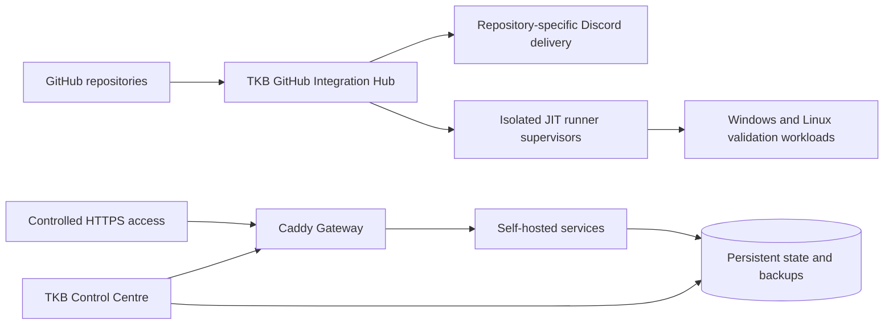

<div align="center">


<br>

[](#about)
[](#team-killing-bastards)
[](#portfolio-command-board)
[](#open-source-and-upstream-work)

[](https://github.com/Conroy1988)
[](https://github.com/Conroy1988?tab=followers)
[](https://github.com/Conroy1988/missionchief-toolkit-assets/releases/latest)
[](https://github.com/Conroy1988/Achievements/releases/latest)

### I turn fragmented workflows into controlled, visible, recoverable systems.

**Operational software · Community infrastructure · GitHub automation · Market intelligence · Persistent games · Self-hosting**

[**Portfolio**](#portfolio-command-board) · [**Public products**](#public-products) · [**Private systems**](#private-systems) · [**TKB**](#team-killing-bastards) · [**Open source**](#open-source-and-upstream-work) · [**Infrastructure**](#conroymedia-and-self-hosting) · [**Activity**](#github-activity)

</div>

---

# About

I am **Conroy**, an operations-minded systems builder based in **Edinburgh, Scotland**.

My work usually begins where a process has become fragmented, repetitive, difficult to understand, or unsafe to maintain. I map the real workflow, identify the missing control layer, and build a system that makes the operation clearer, faster, more accountable, and easier to recover.

I work across product direction, software architecture, interface design, automation, release engineering, repository governance, technical documentation, deployment, networking, and live-system ownership.

My professional background in **office and operations management** materially shapes the way I build. Permissions, audit evidence, exception handling, live verification, ownership, documentation, backup, and recovery are treated as product requirements rather than final-stage polish.

<table>
<tr>
<td width="25%" align="center" valign="top"><strong>⚙️ BUILD</strong><br><sub>Convert operational friction into a usable control system.</sub></td>
<td width="25%" align="center" valign="top"><strong>🧭 CLARIFY</strong><br><sub>Expose the information required for safer decisions.</sub></td>
<td width="25%" align="center" valign="top"><strong>🛡️ STABILISE</strong><br><sub>Add validation, boundaries, evidence, and recovery paths.</sub></td>
<td width="25%" align="center" valign="top"><strong>◈ OPERATE</strong><br><sub>Maintain the finished system as a live product.</sub></td>
</tr>
</table>

---

# Portfolio Command Board

<div align="center">


</div>

## Current responsibility map

| Domain | Systems | My responsibility |
|---|---|---|
| **Public products** | MissionChief Map Command Toolkit; GitHub Achievement Encyclopedia | Creator, maintainer, release authority, and operational owner |
| **Private operational platform** | TKB Discord Bot | Sole developer, security authority, deployment owner, and live operator |
| **Private research platform** | Investor Matrix | Project lead, Admin authority, architecture, and delivery direction |
| **Private game system** | UK Fire Command | Creator, product owner, architecture authority, and development lead |
| **Community and governance** | Team Killing Bastards | Founder, original owner, community leader, organisation governance, and technical direction |
| **Project support** | MissionChief Command Nexus; Blyth Control Centre | Repository, documentation, governance, and delivery support without claiming Marty-owned development |
| **Open source** | LSSM V.4 | Scoped upstream contribution work under upstream maintainer authority |
| **Infrastructure** | ConroyMedia | Docker, Caddy, networking, monitoring, backup, recovery, and private deployment operations |

## First-party systems

| System | Current state | Core purpose |
|---|---|---|
| **MissionChief Map Command Toolkit** | Verified `v4.20.24` | Mission intelligence, specialist fleet identity, map coverage, transport, finance, and configurable command interfaces |
| **GitHub Achievement Encyclopedia** | Formal `v1.4.0`; active `v1.5.0` campaign | Evidence-led achievement research, public guides, verification timelines, and static API |
| **TKB Discord Bot** | Operational | Discord automation, Control Centre 2.0, GitHub Integration Hub, HTTPS Gateway, moderation, and deployment operations |
| **Investor Matrix** | Phase 0 foundation | Authenticated market-intelligence and risk-control platform with recoverable infrastructure |
| **UK Fire Command** | Active development | Persistent Scotland/England Fire and Rescue management game |

---

# Public Products

## MissionChief Map Command Toolkit

<table>
<tr>
<td width="68%" valign="top">

### A complete operational command layer for MissionChief

The **MissionChief Map Command Toolkit** transforms the normal MissionChief map into a configurable operations console.

**Current verified release: `v4.20.24`**

**Current capability**

- Mission Age Watch, Critical View, Mission Inspector, and Major Incident Feed
- Live Mission Requirements with required, on-site, responding, selected, and still-needed reconciliation
- Patient and prisoner transport monitoring and controlled alliance Transport Sweep
- Specialist Own Vehicle Category badges without overriding native vehicle identity
- Resource Gap, fleet-code posture, vehicle loading, and visibility controls
- Heat maps, coverage rings, bookmarks, focus modes, and map command workflows
- Alliance mission value, session performance, payout presentation, and Financial Advisor reporting
- Seven complete interface systems across desktop, ultrawide, tablet, and mobile layouts
- Canonical source, full audits, release manifests, Greasy Fork parity, and private recovery evidence

Version 4.20.24 reconciles detailed Financial Advisor transactions against MissionChief's `/credits/overview` Revenue, Spendings, and Sum checkpoints without double counting. The same canonical model feeds the dashboard, Discord financial reports, and generated Financial Command graphics.

</td>
<td width="32%" align="center" valign="top">

### FLAGSHIP PUBLIC PRODUCT

[](https://github.com/Conroy1988/missionchief-toolkit-assets/releases/latest)
[](https://greasyfork.org/en/scripts/586018-missionchief-map-command-toolkit)
[](https://greasyfork.org/en/scripts/586018-missionchief-map-command-toolkit)
[](https://github.com/Conroy1988/missionchief-toolkit-assets/actions/workflows/validate-userscript.yml)

**Creator · Maintainer · Release authority**  
`Conroy1988`

[**⬇ Install the Toolkit**](https://update.greasyfork.org/scripts/586018/MissionChief%20Map%20Command%20Toolkit.user.js)

[Repository](https://github.com/Conroy1988/missionchief-toolkit-assets) · [Documentation](https://conroy1988.github.io/missionchief-toolkit-assets/)  
[Releases](https://github.com/Conroy1988/missionchief-toolkit-assets/releases) · [Issues](https://github.com/Conroy1988/missionchief-toolkit-assets/issues)

</td>
</tr>
</table>

## GitHub Achievement Encyclopedia

<table>
<tr>
<td width="68%" valign="top">

### Evidence-led research into GitHub profile achievements

The **GitHub Achievement Encyclopedia** separates official documentation, reproduced behaviour, credible observations, historical material, community reporting, and unresolved claims instead of presenting all of them as equal facts.

**Current state**

- Formal evidence-quality release: `v1.4.0`
- Active research campaign: `v1.5.0`
- Repository health: `100/100 — Excellent`
- Seven active and two retired achievement guides
- Sixteen public static API endpoints
- Seventeen-control unified repository audit
- Official-document fingerprint monitoring
- Privacy-safe evidence records and verification timelines
- Campaign-classified active, blocked, monitoring, queued, and completed research tasks

</td>
<td width="32%" align="center" valign="top">

### PUBLIC RESEARCH PLATFORM

[](https://github.com/Conroy1988/Achievements/releases/latest)
[](https://conroy1988.github.io/Achievements/)
[](https://github.com/Conroy1988/Achievements/blob/main/docs/research-hub.md)

**Creator · Maintainer · Research owner**  
`Conroy1988`

[**◈ Explore the encyclopedia**](https://conroy1988.github.io/Achievements/)

[Repository](https://github.com/Conroy1988/Achievements) · [Search](https://conroy1988.github.io/Achievements/search/)  
[Evidence](https://github.com/Conroy1988/Achievements/blob/main/docs/evidence-register.md) · [Research hub](https://github.com/Conroy1988/Achievements/blob/main/docs/research-hub.md)

</td>
</tr>
</table>

---

# Private Systems

## TKB Discord Bot

**Sole developer · Maintainer · Security and operational authority**

The private **TKB Discord Bot** is the operational backbone of the Team Killing Bastards Discord and development environment.

### Discord and community platform

- Commands, events, scheduling, countdowns, and dashboard messaging
- Levels, ranks, leaderboards, gamification tokens, daily claims, streaks, and achievements
- Starboard, Battlefield profiles, Moments with Marty, AI mention replies, and Giphy
- Join, leave, edit, delete, role, activity, and command logging
- Immutable moderation case numbers, assignment, severity, status, and append-only notes
- Feature access control by module, Discord role, and member

### Control Centre 2.0

- Authenticated FastAPI administration shell
- Executive health overview and feature workspaces
- Transactional SQLite state
- Encrypted integration credentials
- Signed sessions, CSRF protection, rate limits, and audit evidence
- Sanitised operations snapshots and restricted host controls

### GitHub Integration Hub

- Separate `Team-Killing-Bastards`, `Conroy1988`, and `MartyBlyth` workspaces
- Owner-scoped GitHub App connectors and repository discovery
- Signed webhook verification and replay suppression
- Repository-specific Discord delivery with retries and dead-letter recovery
- Repository, owner, trust, operating-system, and architecture-scoped JIT runner pools
- Workflow-run and job evidence
- Exact retry and reconciliation controls
- Automated production checks, controlled probes, and typed audited sign-off

### HTTPS Gateway and deployment operations

- Registry-driven Caddy routes
- Validation, adoption, deployment, disable, rollback, reconcile, and abandon workflows
- Exact router forwarding cards
- Backup, update, restore, rollback, and immutable recovery evidence
- Restricted Windows host agent without a generic shell or Docker endpoint

[**🔒 Private repository**](https://github.com/Team-Killing-Bastards/TKB-Discord-Bot)

## Investor Matrix

**Project lead · Admin authority · Technical direction**

Investor Matrix is a private market-intelligence and risk-control platform currently at **Phase 0**.

**Implemented foundation**

- Next.js command centre and FastAPI API
- PostgreSQL users, sessions, audit events, and versioned Alembic migrations
- Redis and separate liveness/readiness checks
- Fixed Admin and Member roles
- Argon2 authentication, HTTP-only sessions, CSRF protection, throttling, and lockout
- Password changes, active-session inventory, forced revocation, and filtered audit history
- Admin-only fast-forward GitHub updater
- SHA-256-verified PostgreSQL backups and transactional restoration

Market ingestion, portfolio accounting, risk analytics, backtesting, and explainable signals remain deliberately gated behind later phases.

[**🔒 Private repository**](https://github.com/Team-Killing-Bastards/Investor-Matrix)

## UK Fire Command

**Creator · Product owner · Architecture authority**

UK Fire Command is a private, persistent, map-first Fire and Rescue Service management game.

**Current command loop**

- Isolated commander accounts
- Scotland and England operating regions
- Persistent station placement and upgrades
- Server-controlled appliance purchasing
- Specialist firefighter training and qualification-valid mobilising
- Relaxed, Standard, and Demanding incident tempo
- Five UK-local demand periods with time-weighted incident mixes
- Real-road OSRM routing and animated appliance travel
- Incident escalation and additional-resource requests
- Server-authoritative on-scene resolution
- Immutable credit transactions
- Appliance return, crew release, and maintenance lifecycle
- Responsive desktop, tablet, mobile, and installable web-app behaviour

**Architecture:** Next.js, NestJS, PostgreSQL/PostGIS, MapLibre, OpenFreeMap, OSRM, persistent workers, and Docker Compose.

[**🔒 Private repository**](https://github.com/Conroy1988/uk-fire-command)

---

# Team Killing Bastards

<div align="center">

[](https://github.com/Team-Killing-Bastards)
[](https://github.com/Team-Killing-Bastards)

</div>

I **founded and originally created [Team Killing Bastards](https://github.com/Team-Killing-Bastards)**, a Scottish-run gaming community whose software, automation, game tooling, research, and infrastructure are maintained through GitHub.

I retain founder and original-owner responsibility for the community's identity, governance, direction, and long-term stewardship. I lead TKB alongside **[MartyBlyth](https://github.com/Martyblyth)**, my right-hand and fellow community leader.

## Organisation systems

| System | Technical authority | My role |
|---|---|---|
| **TKB Discord Bot** | Conroy1988 | Sole developer, maintainer, security authority, and operator |
| **Investor Matrix** | Conroy1988 | Project lead, Admin authority, and delivery owner |
| **MissionChief Command Nexus** | MartyBlyth | Repository infrastructure, documentation, validation, and general support |
| **Blyth Control Centre** | MartyBlyth | Organisation governance and portfolio support |

## Marty-owned systems I support

### MissionChief Command Nexus

**Current production version: `1.0.14` · Mission Finder engine: `V10.6.80`**

Command Nexus combines Marty's Mission Finder and Unit, Station & Personnel Tools into one userscript covering station and vehicle naming, personnel assignment, training registers, live Mission Requirements, exact specialist matching, Unit Finder, Mission Update, upgrades, and Auto Mode.

**MartyBlyth is the creator, userscript author, technical owner, and release authority.** My role is repository, documentation, validation, and general project support; I am not presented as the userscript developer.

[Repository](https://github.com/Team-Killing-Bastards/MissionChief-Command-Nexus) · [Install](https://greasyfork.org/en/scripts/587702-missionchief-command-nexus) · [Issues](https://github.com/Team-Killing-Bastards/MissionChief-Command-Nexus/issues)

### Blyth Control Centre

**Current version: `0.4.0`**

Blyth Control Centre is Marty's private household command surface for Home Assistant, Synology NAS telemetry, Emby, Radarr, Sonarr, NZBGet, and future camera and Bambu printer integrations.

It uses a hardened Node.js/Express container, concurrent server-side adapters, explicit degraded states, Synology Docker deployment, and an external identity/access logout workflow.

**MartyBlyth is the creator, project owner, and primary developer.** My role is shared organisation governance and portfolio support.

[**🔒 Private repository**](https://github.com/Team-Killing-Bastards/blyth-control-centre)

## Governance model

| Principle | Meaning |
|---|---|
| **Community leadership is shared** | Conroy and Marty jointly lead the community |
| **Technical authority remains explicit** | Every software system retains a named owner and release authority |
| **Trust domains remain separate** | Discord, userscripts, household systems, games, and market research do not share credentials or runtime control |
| **Support does not transfer ownership** | Repository or documentation help does not replace the creator's authority |

---

# Open Source and Upstream Work

## LSSM V.4

I contribute improvements to the wider MissionChief tooling ecosystem when an upstream project is the correct destination.

My current upstream pull request adds optional monospaced note editing and preview support across the project's supported locale files.

[](https://github.com/LSS-Manager/LSSM-V.4/pull/3982)
[](https://github.com/LSS-Manager/LSSM-V.4)
[](https://github.com/LSS-Manager/LSSM-V.4/pull/3982)

**Contribution scope**

- Optional `noteMonospace` setting
- Native and redesigned note-editor support
- Note-preview support
- Ten locale updates
- English documentation update
- Disabled by default
- Unrelated inputs and textareas unaffected

The pull request remains under LSSM maintainer review. The upstream project retains full ownership, merge authority, and release control.

## Supporting and derived repositories

| Repository | Classification |
|---|---|
| [`Conroy1988/LSSM-V.4`](https://github.com/Conroy1988/LSSM-V.4) | Fork and contribution workspace; not an original Conroy product |
| `missionchief-map-command-toolkit-private` | Private Toolkit release backup and disaster-recovery boundary |
| [`Conroy1988/RED4ext`](https://github.com/Conroy1988/RED4ext) | Third-party fork/reference; not an original product |
| [`Conroy1988/Conroy1988`](https://github.com/Conroy1988/Conroy1988) | Source repository for this profile and repository-owned graphics |

---

# ConroyMedia and Self-Hosting

ConroyMedia is a working home-lab environment used to operate and test real deployment, networking, monitoring, and recovery workflows.

- Docker-hosted services and persistent storage
- Caddy reverse proxying and managed HTTPS routes
- DDNS and controlled remote access
- Emby and media automation services
- Local dashboards and service-health monitoring
- Windows and Linux administration
- GitHub App, webhook, runner, and workflow integration testing
- Backup, restore, rollback, and disaster-recovery exercises
- Private application deployment and bounded internet exposure

## Current infrastructure relationship



This is treated as a live operational environment rather than a decorative lab. Deployment, health, route, backup, and recovery claims are expected to survive real use.

---

# Technical Stack

<div align="center">

### Languages and interface engineering


### Applications, data, and automation


### Maps, integration, and operations


</div>

---

# Live Operations Board

Public signals update automatically. Private repositories use explicit status because their activity is not exposed through public profile APIs.

| System | Release / state | Repository activity | Current posture |
|---|---|---|---|
| **Map Command Toolkit** | [](https://github.com/Conroy1988/missionchief-toolkit-assets/releases/latest) | [](https://github.com/Conroy1988/missionchief-toolkit-assets/commits/main) | v4.20.24 · verified delivery |
| **Achievement Encyclopedia** | [](https://github.com/Conroy1988/Achievements/releases/latest) | [](https://github.com/Conroy1988/Achievements/commits/main) | v1.5.0 campaign · 100/100 health |
| **Command Nexus** | [](https://github.com/Team-Killing-Bastards/MissionChief-Command-Nexus/releases/latest) | [](https://github.com/Team-Killing-Bastards/MissionChief-Command-Nexus/commits/main) | Marty-owned · v1.0.14 |
| **TKB organisation profile** | Public | [](https://github.com/Team-Killing-Bastards/.github/commits/main) | Portfolio and governance |
| **TKB Discord Bot** | Private | Operational | GitHub Hub · Gateway · Control Centre |
| **Investor Matrix** | Private | Phase 0 | Authenticated · backed up · recoverable |
| **UK Fire Command** | Private | Active development | Persistent Scotland/England command loop |
| **Blyth Control Centre** | Private | Marty-owned v0.4.0 | NAS · Emby · Radarr · Sonarr · NZBGet |
| **LSSM contribution** | [PR #3982](https://github.com/LSS-Manager/LSSM-V.4/pull/3982) | Upstream review | Feature + ten locales |

---

# Complete Repository Index

## Personal repositories

| Repository | Visibility | Classification | Purpose |
|---|---:|---|---|
| [missionchief-toolkit-assets](https://github.com/Conroy1988/missionchief-toolkit-assets) | Public | First-party product | Toolkit source, releases, documentation, and public distribution |
| [Achievements](https://github.com/Conroy1988/Achievements) | Public | First-party research platform | Achievement Encyclopedia, evidence system, Pages site, and API |
| [uk-fire-command](https://github.com/Conroy1988/uk-fire-command) | Private | First-party game | Persistent UK Fire and Rescue management game |
| `missionchief-map-command-toolkit-private` | Private | Recovery boundary | Toolkit validated release backups and recovery evidence |
| [Conroy1988](https://github.com/Conroy1988/Conroy1988) | Public | Profile infrastructure | Personal profile source, local cards, and visual assets |
| [LSSM-V.4](https://github.com/Conroy1988/LSSM-V.4) | Public fork | Contribution workspace | Upstream LSSM work; not an original product |
| [RED4ext](https://github.com/Conroy1988/RED4ext) | Public fork | Third-party reference | Retained fork; not an original product |

## Team Killing Bastards repositories

| Repository | Visibility | My relationship |
|---|---:|---|
| [TKB-Discord-Bot](https://github.com/Team-Killing-Bastards/TKB-Discord-Bot) | Private | Sole developer and operational authority |
| [Investor-Matrix](https://github.com/Team-Killing-Bastards/Investor-Matrix) | Private | Project lead and Admin authority |
| [MissionChief-Command-Nexus](https://github.com/Team-Killing-Bastards/MissionChief-Command-Nexus) | Public | Repository and documentation support for Marty-owned software |
| [blyth-control-centre](https://github.com/Team-Killing-Bastards/blyth-control-centre) | Private | Organisation governance and portfolio support for Marty-owned software |
| [.github](https://github.com/Team-Killing-Bastards/.github) | Public | Organisation profile, visual assets, and governance presentation |
| [demo-repository](https://github.com/Team-Killing-Bastards/demo-repository) | Private | Internal sandbox; not a product |

---

# How I Build

| Principle | Meaning in practice |
|---|---|
| **Solve the operational problem** | Features begin with a real delay, risk, failure, or information gap |
| **Keep authority visible** | The system shows what it knows, what it changed, and what still requires judgement |
| **Validate the live result** | A successful request is not assumed to be a successful outcome |
| **Design for maintenance** | Issues, branches, releases, documentation, backups, and migrations are part of the product |
| **Protect trust boundaries** | Secrets, owner domains, household data, financial data, and privileged runners remain separated |
| **Build responsive behaviour deliberately** | Desktop, ultrawide, tablet, and mobile use are considered during design |
| **Polish after correctness** | Reliability comes first; mature systems should still feel coherent and deliberate |

```text
Observe the real workflow
        ↓
Identify friction, ambiguity, and failure points
        ↓
Design a visible control layer
        ↓
Build, validate, and document it
        ↓
Operate it under real conditions
        ↓
Improve without sacrificing stability
```

---

# GitHub Activity

<div align="center">


<sub>The five primary cards are generated daily inside this repository from GitHub's API. Private repositories, private runner work, and some organisation contributions remain intentionally outside public statistics.</sub>

</div>

---

# Away From the Repository

I am usually somewhere around PC gaming, self-hosted infrastructure, interface concepts, music experiments, or another piece of technology that has decided it needs diagnosing.

Development is routinely supervised by **Eli and Nala**, who contribute no code but maintain strict control over keyboard availability. 🐈‍⬛🐈

---

<div align="center">

## Conroy1988

### Build useful systems. Operate them seriously. Improve them with evidence.

**Software · Automation · Operations · Research · Game systems · Community infrastructure**

[](https://github.com/Conroy1988)
[](https://github.com/Team-Killing-Bastards)

<sub>Personal projects and community systems are developed independently from the third-party platforms they extend or reference. Product names and trademarks remain the property of their respective owners.</sub>

</div>
