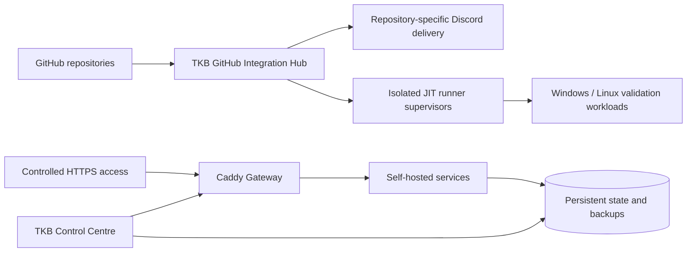

<div align="center">


<br>

[](#about)
[](#team-killing-bastards)
[](#portfolio-command-board)
[](#open-source-and-upstream-work)

[](https://github.com/Conroy1988)
[](https://github.com/Conroy1988?tab=followers)
[](https://github.com/Conroy1988/missionchief-toolkit-assets/releases/latest)
[](https://github.com/Conroy1988/Achievements/releases/latest)

### I turn fragmented real-world workflows into controlled, visible, recoverable systems.

**Operational software · Community infrastructure · GitHub automation · Market intelligence · Persistent games · Self-hosting**

[**Portfolio**](#portfolio-command-board) · [**Public products**](#public-products) · [**Private systems**](#private-systems) · [**TKB**](#team-killing-bastards) · [**Open source**](#open-source-and-upstream-work) · [**Infrastructure**](#conroymedia-and-self-hosting) · [**Activity**](#github-activity)

</div>

---

# About

I am **Conroy**, an operations-minded systems builder based in **Edinburgh, Scotland**.

My work usually begins where a process has become fragmented, repetitive, unclear, or unsafe to maintain. I map the real workflow, identify the missing control layer, and build a system that makes the operation faster to understand, harder to misuse, and easier to recover.

I work across product direction, software architecture, interface design, automation, release engineering, repository governance, technical documentation, deployment, networking, and live-system ownership. My professional background in **office and operations management** shapes the way I build: accountability, audit evidence, exception handling, permissions, and recovery are product requirements—not afterthoughts.

<table>
<tr>
<td width="25%" align="center" valign="top">

### ⚙️ BUILD

Convert operational friction into a usable control system.

</td>
<td width="25%" align="center" valign="top">

### 🧭 CLARIFY

Expose the information required for faster, safer decisions.

</td>
<td width="25%" align="center" valign="top">

### 🛡️ STABILISE

Add validation, boundaries, audit trails, and recovery paths.

</td>
<td width="25%" align="center" valign="top">

### ◈ OPERATE

Maintain the finished system as a live product rather than a disposable prototype.

</td>
</tr>
</table>

---

# Portfolio Command Board

<div align="center">


</div>

## Current responsibility map

| Domain | Systems | My responsibility |
|---|---|---|
| **Public products** | MissionChief Map Command Toolkit · GitHub Achievement Encyclopedia | Creator, maintainer, technical direction, release authority, documentation, and live publication |
| **Community operations** | TKB Discord Bot · Team Killing Bastards organisation | Founder and community leader; sole bot developer and operational authority; organisation governance and technical infrastructure |
| **Private platforms** | Investor Matrix · UK Fire Command | Project lead / Admin authority for Investor Matrix; creator and architecture owner for UK Fire Command |
| **Member project support** | MissionChief Command Nexus · Blyth Control Centre | Repository, documentation, governance, and organisation support while Marty retains technical ownership |
| **Open source** | LSSM V.4 | Scoped upstream feature contribution under upstream maintainer review |
| **Infrastructure** | ConroyMedia | Docker, Caddy, DDNS, networking, GitHub integration, self-hosted runners, monitoring, backup, deployment, and recovery |

## Ownership matrix

| System | Relationship | Technical authority |
|---|---|---|
| **MissionChief Map Command Toolkit** | My flagship public product | **Conroy1988** |
| **GitHub Achievement Encyclopedia** | My public research platform | **Conroy1988** |
| **TKB Discord Bot** | My private operational platform | **Conroy1988** |
| **Investor Matrix** | Project I lead and administer | **Conroy1988** |
| **UK Fire Command** | Private game I created | **Conroy1988** |
| **MissionChief Command Nexus** | Marty-owned project I support | **MartyBlyth** |
| **Blyth Control Centre** | Marty-owned project hosted through TKB | **MartyBlyth** |

> Supporting a project through GitHub, documentation, testing, organisation governance, or release infrastructure does not transfer the creator's technical ownership.

---

# Public Products

## MissionChief Map Command Toolkit

<table>
<tr>
<td width="68%" valign="top">

### A complete operational command layer for MissionChief

The **MissionChief Map Command Toolkit** transforms the standard MissionChief map into a configurable operations console. It combines live mission intelligence, specialist fleet identity, geographic coverage, navigation, finance, payout presentation, interface themes, and device-specific control systems inside one maintained userscript.

**Current capability**

- Live mission requirements, response-state reconciliation, and resource-gap analysis
- Mission age, critical-state, transport, and major-incident workflows
- Specialist vehicle identity using persistent operational badges
- Coverage heat maps, rings, bookmarks, visibility controls, and focused map states
- Alliance credit intelligence, financial reporting, and session-performance tracking
- Multiple complete payout and presentation themes
- Desktop, ultrawide, tablet, and mobile-safe interfaces
- Canonical validation, full audits, structured issues, release archives, and update manifests
- GitHub, Greasy Fork, private-backup, Discord-release, and asset-readiness verification

</td>
<td width="32%" align="center" valign="top">

### FLAGSHIP PUBLIC PRODUCT

[](https://github.com/Conroy1988/missionchief-toolkit-assets/releases/latest)
[](https://greasyfork.org/en/scripts/586018-missionchief-map-command-toolkit)
[](https://greasyfork.org/en/scripts/586018-missionchief-map-command-toolkit)
[](https://github.com/Conroy1988/missionchief-toolkit-assets/actions/workflows/validate-userscript.yml)

**Creator · Maintainer · Release authority**  
`Conroy1988`

[**⬇ Install the Toolkit**](https://update.greasyfork.org/scripts/586018/MissionChief%20Map%20Command%20Toolkit.user.js)

[Repository](https://github.com/Conroy1988/missionchief-toolkit-assets) · [Documentation](https://conroy1988.github.io/missionchief-toolkit-assets/)  
[Releases](https://github.com/Conroy1988/missionchief-toolkit-assets/releases) · [Issues](https://github.com/Conroy1988/missionchief-toolkit-assets/issues)

</td>
</tr>
</table>

---

## GitHub Achievement Encyclopedia

<table>
<tr>
<td width="68%" valign="top">

### Evidence-led research into GitHub profile achievements

The **GitHub Achievement Encyclopedia** is a maintained public research and reference platform for active, retired, and historically observed GitHub profile achievements. It separates verified behaviour from community folklore through evidence classifications, confidence levels, review dates, and reproducible research tasks.

**Platform capability**

- Maintained guides for active, retired, and historically observed achievements
- Evidence registers, source inventories, confidence classifications, and verification timelines
- Searchable GitHub Pages reference site
- Machine-readable datasets and public static API endpoints
- Privacy-aware research tasks and contribution guidance
- Automated content-quality, freshness, evidence-coverage, and repository-health auditing
- Versioned releases and a formal research infrastructure

</td>
<td width="32%" align="center" valign="top">

### PUBLIC RESEARCH PLATFORM

[](https://github.com/Conroy1988/Achievements/releases/latest)
[](https://conroy1988.github.io/Achievements/)
[](https://github.com/Conroy1988/Achievements/stargazers)
[](https://github.com/Conroy1988/Achievements/actions/workflows/content-quality.yml)

**Creator · Maintainer · Research owner**  
`Conroy1988`

[**◈ Explore the encyclopedia**](https://conroy1988.github.io/Achievements/)

[Repository](https://github.com/Conroy1988/Achievements) · [Search](https://conroy1988.github.io/Achievements/search/)  
[Evidence register](https://github.com/Conroy1988/Achievements/blob/main/docs/evidence-register.md) · [Research hub](https://github.com/Conroy1988/Achievements/blob/main/docs/research-hub.md)

</td>
</tr>
</table>

---

# Private Systems

## TKB Discord Bot

<table>
<tr>
<td width="68%" valign="top">

### Community command system and private development operations platform

The **TKB Discord Bot** is the operational backbone of the Team Killing Bastards Discord and development environment. I am its sole developer, maintainer, and operational authority.

**Platform scope**

- Discord commands, events, scheduler, countdowns, dashboard messaging, and community automation
- Levels, gamification, achievements, starboard, Battlefield, Marty, AI, and Giphy modules
- Moderation logging, immutable cases, append-only notes, and administrator audit history
- FastAPI **Control Centre 2.0** with signed sessions, CSRF protection, live events, and responsive workspaces
- Transactional SQLite state, encrypted credentials, migration evidence, and integrity verification
- Managed Caddy HTTPS Gateway with route registry, diagnostics, validation, adoption, deployment, rollback, and stale-operation recovery
- Restricted Windows host agent for backups, updates, restoration, health verification, and automatic rollback
- Multi-owner GitHub Integration Hub for `Team-Killing-Bastards`, `Conroy1988`, and `MartyBlyth`
- GitHub App discovery, signed webhook intake, repository-specific Discord routing, isolated JIT runners, workflow evidence, controlled recovery, and typed production sign-off
- Linux, Windows, Docker, Caddy, browser, dependency, and runtime validation

</td>
<td width="32%" align="center" valign="top">

### PRIVATE OPERATIONAL PLATFORM


**Sole developer · Maintainer · Operational authority**

[**🔒 Private repository**](https://github.com/Team-Killing-Bastards/TKB-Discord-Bot)

</td>
</tr>
</table>

---

## Investor Matrix

<table>
<tr>
<td width="50%" valign="top">

### Authenticated market-intelligence foundation

**Project lead · Administrative authority**

Investor Matrix is a private, self-hosted market-intelligence, portfolio-analysis, risk-control, and investment decision-support platform.

**Current Phase 0 implementation**

- FastAPI API and Next.js command-centre dashboard
- PostgreSQL-backed users, sessions, and append-only audit events
- Independent Admin and Member account roles
- Argon2 password hashing, HTTP-only sessions, CSRF protection, throttling, and lockout
- Password changes, active-session inventory, and forced revocation
- Filtered and paginated administrative audit history
- Versioned Alembic migrations and fail-closed readiness checks
- PostgreSQL backup, SHA-256 manifest, transactional restore, and recovery drills
- Admin-only GitHub update checking and controlled Docker deployment
- Isolated updater controller and worker with no public host port
- PostgreSQL, Redis, CI, health checks, and operational telemetry

Market ingestion, portfolio accounting, analytics, backtesting, and investment signals remain intentionally gated behind later phases.

[**🔒 Private repository**](https://github.com/Team-Killing-Bastards/Investor-Matrix)

</td>
<td width="50%" valign="top">

### Architecture and direction


The design programme is built around:

- Evidence before action
- Risk controls outranking opportunity scores
- Mandatory source provenance and freshness
- Replaceable provider adapters
- Reproducible backtesting and walk-forward validation
- Human approval by default
- Private holdings and credentials

> Investor Matrix is analytical software. It cannot eliminate risk, guarantee returns, or replace professional financial advice.

</td>
</tr>
</table>

---

## UK Fire Command

<table>
<tr>
<td width="68%" valign="top">

### Persistent map-first UK Fire and Rescue management game

I created **UK Fire Command** as a private game platform built around persistent commander accounts, real geography, operational fleet management, trained crews, incident escalation, and authoritative server-side state.

**Current command loop**

- Isolated commander accounts and selectable UK operating regions
- Persistent station placement, upgrades, and server-controlled fleet purchasing
- Specialist firefighter training and qualification-valid mobilising
- Automatic incident allocation with configurable demand tempo
- Real-road routing and animated appliance movement
- Incident escalation and additional-resource requests
- Authoritative on-scene resolution and immutable credit ledger
- Maintenance, crew release, and return-to-station lifecycle
- Responsive desktop, tablet, and mobile command interface

</td>
<td width="32%" align="center" valign="top">

### PRIVATE GAME SYSTEM


**Creator · Product and architecture owner**

[**🔒 Private repository**](https://github.com/Conroy1988/uk-fire-command)

</td>
</tr>
</table>

---

# Team Killing Bastards

<div align="center">

[](https://github.com/Team-Killing-Bastards)
[](https://github.com/Team-Killing-Bastards)

</div>

I **founded and originally created [Team Killing Bastards](https://github.com/Team-Killing-Bastards)**, a Scottish-run gaming community whose software, automation, tooling, research, and private infrastructure are maintained through GitHub.

I retain founder and original-owner responsibility for the community's identity, direction, governance, and long-term stewardship. I lead TKB alongside **[MartyBlyth](https://github.com/Martyblyth)**, my right-hand and fellow community leader.

## Organisation portfolio

| System | Technical authority | My involvement |
|---|---|---|
| **TKB Discord Bot** | **Conroy1988** | Sole development, maintenance, security, deployment, and operational authority |
| **Investor Matrix** | **Conroy1988** | Project lead, Admin authority, architecture direction, and delivery ownership |
| **MissionChief Command Nexus** | **MartyBlyth** | Repository infrastructure, documentation, organisation support, and general project assistance; not the userscript developer |
| **Blyth Control Centre** | **MartyBlyth** | Shared organisation governance and portfolio support; Marty retains full project authority |

## TKB GitHub integration

The TKB Discord Bot contains a private multi-owner GitHub Integration Hub that supports:

- Separate owner workspaces for `Team-Killing-Bastards`, `Conroy1988`, and `MartyBlyth`
- Encrypted GitHub App connectors and owner-verified repository discovery
- Signed webhook intake and replay suppression
- Repository-specific Discord destinations with durable retries and dead-letter recovery
- Repository-, owner-, trust-, operating-system-, and architecture-scoped JIT runner pools
- Isolated Linux and Windows supervisors
- Bounded workflow-run and workflow-job evidence
- Controlled run reconciliation and failed-job retry
- Automated production verification, controlled webhook probes, manual attestations, and typed owner sign-off

This lets shared infrastructure support Dan, Marty, and the organisation without collapsing their separate credentials, repositories, permissions, or technical ownership.

## Shared governance model

| Principle | Meaning inside TKB |
|---|---|
| **Community leadership is shared** | Conroy and Marty jointly lead the community. |
| **Technical authority remains explicit** | Each system retains an accountable creator, owner, and release authority. |
| **Trust domains remain separate** | Discord infrastructure, userscripts, home systems, personal repositories, and market research do not share credentials or runtime control. |
| **Repository support does not transfer ownership** | Documentation, governance, or infrastructure assistance does not replace the creator's authority. |

[**Open the complete TKB organisation portfolio**](https://github.com/Team-Killing-Bastards)

---

# Marty-Owned Systems I Support

## MissionChief Command Nexus

**MissionChief Command Nexus** is developed by **MartyBlyth**, its creator, userscript author, technical owner, and release authority.

My role is deliberately narrower:

- Repository setup and organisation hosting
- Documentation and public presentation
- Issue, release, and workflow support
- General testing and project assistance
- GitHub and Discord integration infrastructure

The system combines station, vehicle, and personnel administration with qualification-aware mission matching and dispatch automation for MissionChief UK.

[](https://github.com/Team-Killing-Bastards/MissionChief-Command-Nexus/releases/latest)
[](https://greasyfork.org/en/scripts/587702-missionchief-command-nexus)
[](https://github.com/Team-Killing-Bastards/MissionChief-Command-Nexus/issues)

[Repository](https://github.com/Team-Killing-Bastards/MissionChief-Command-Nexus) · [Install](https://greasyfork.org/en/scripts/587702-missionchief-command-nexus)

## Blyth Control Centre

**Blyth Control Centre** is Marty's private self-hosted home-operations dashboard for Home Assistant, Synology telemetry, and the wider Blyth technology estate.

I support its organisation hosting and portfolio presentation. Marty remains the project owner and primary developer.

[**🔒 Private repository**](https://github.com/Team-Killing-Bastards/blyth-control-centre)

---

# Open Source and Upstream Work

## LSSM V.4

I contribute improvements to the wider MissionChief tooling ecosystem where an upstream project is the correct destination.

My current open contribution adds an optional monospaced note-editor mode to **LSSM V.4**, including redesigned editor and note-preview support plus localisation across ten supported locale files.

[](https://github.com/LSS-Manager/LSSM-V.4/pull/3982)
[](https://github.com/LSS-Manager/LSSM-V.4)
[](https://github.com/LSS-Manager/LSSM-V.4/pull/3982)

**Contribution principles**

- Work from the upstream project's current architecture and contribution rules
- Keep changes scoped, reviewable, and based on the correct development branch
- Include documentation, localisation, and regression protection where required
- Preserve upstream ownership and maintainer authority

## Supporting repositories

| Repository | Purpose |
|---|---|
| [`Conroy1988/LSSM-V.4`](https://github.com/Conroy1988/LSSM-V.4) | Fork and contribution workspace for upstream LSSM work |
| `missionchief-map-command-toolkit-private` | Private support, recovery, and release boundary for the public Toolkit |
| [`Conroy1988/RED4ext`](https://github.com/Conroy1988/RED4ext) | Third-party fork/reference; not presented as an original product |
| [`Conroy1988/Conroy1988`](https://github.com/Conroy1988/Conroy1988) | Source repository for this profile and its visual assets |

---

# ConroyMedia and Self-Hosting

**ConroyMedia** is the working home infrastructure used to operate and test real deployment, networking, integration, and recovery workflows.

## Operating scope

- Docker-hosted applications and persistent storage
- Media automation, request management, and service monitoring
- Caddy reverse proxying, HTTPS certificates, DDNS, and controlled remote access
- Windows and Linux system administration
- Local GitHub Actions runner experimentation and isolated supervisor design
- GitHub webhook, Discord routing, and repository integration testing
- Backup, restore, deployment, and rollback exercises
- Private application testing and bounded internet exposure

## Current infrastructure relationship



This is treated as a live operational environment rather than a decorative lab. Deployments, health checks, routes, backups, and recovery paths are expected to work under real conditions.

---

# Technical Stack

<div align="center">

### Languages and interface engineering


### Applications, data, and automation


### Maps, integration, and operations


</div>

---

# Live Operations Board

Public signals update automatically. Private repositories use explicit state badges because their activity is not exposed through public profile APIs.

| System | Release / state | Repository activity | Work queue / posture |
|---|---|---|---|
| **Map Command Toolkit** | [](https://github.com/Conroy1988/missionchief-toolkit-assets/releases/latest) | [](https://github.com/Conroy1988/missionchief-toolkit-assets/commits/main) | [](https://github.com/Conroy1988/missionchief-toolkit-assets/issues) |
| **Achievement Encyclopedia** | [](https://github.com/Conroy1988/Achievements/releases/latest) | [](https://github.com/Conroy1988/Achievements/commits/main) | [](https://github.com/Conroy1988/Achievements/issues) |
| **MissionChief Command Nexus** | [](https://github.com/Team-Killing-Bastards/MissionChief-Command-Nexus/releases/latest) | [](https://github.com/Team-Killing-Bastards/MissionChief-Command-Nexus/commits/main) | [](https://github.com/Team-Killing-Bastards/MissionChief-Command-Nexus/issues) |
| **TKB organisation profile** |  | [](https://github.com/Team-Killing-Bastards/.github/commits/main) |  |
| **TKB Discord Bot** |  |  |  |
| **Investor Matrix** |  |  |  |
| **UK Fire Command** |  |  |  |
| **Blyth Control Centre** |  |  |  |
| **LSSM contribution** | [](https://github.com/LSS-Manager/LSSM-V.4/pull/3982) |  |  |

---

# How I Build

| Principle | Meaning in practice |
|---|---|
| **Solve the operational problem** | Features begin with a real failure, delay, risk, or information gap—not a technology looking for a use. |
| **Keep authority visible** | Users should understand what the system knows, what it changed, and what still requires judgement. |
| **Validate the live result** | A successful request is not the same as a successful outcome; important writes and releases are verified. |
| **Design for maintenance** | Canonical branches, ownership, issues, changelogs, backups, evidence, and migration paths are part of the product. |
| **Protect trust boundaries** | Secrets, private state, host operations, owner domains, and privileged runners remain explicitly separated. |
| **Treat responsive behaviour as core** | Desktop, ultrawide, tablet, and mobile use are considered during design rather than patched in afterwards. |
| **Polish after correctness** | Reliability comes first, but mature systems should also feel deliberate, coherent, and professional. |

```text
Observe the real workflow
        ↓
Identify friction, ambiguity, and failure points
        ↓
Design a visible control layer
        ↓
Build, validate, and document it
        ↓
Operate it under real conditions
        ↓
Improve the system without sacrificing stability
```

---

# Complete Repository Index

## Personal repositories

| Repository | Visibility | Purpose |
|---|---:|---|
| [**missionchief-toolkit-assets**](https://github.com/Conroy1988/missionchief-toolkit-assets) | Public | MissionChief Map Command Toolkit source, releases, documentation, and distribution |
| [**Achievements**](https://github.com/Conroy1988/Achievements) | Public | GitHub Achievement Encyclopedia, evidence system, Pages site, and static API |
| [**uk-fire-command**](https://github.com/Conroy1988/uk-fire-command) | Private | Persistent UK Fire and Rescue management game |
| **missionchief-map-command-toolkit-private** | Private | Toolkit support, recovery, and private release boundary |
| [**Conroy1988**](https://github.com/Conroy1988/Conroy1988) | Public | Personal profile source and repository-owned visual assets |
| [**LSSM-V.4**](https://github.com/Conroy1988/LSSM-V.4) | Public fork | Upstream LSSM contribution workspace |
| [**RED4ext**](https://github.com/Conroy1988/RED4ext) | Public fork | Third-party fork/reference; not an original product |

## TKB organisation systems

| Repository | My relationship |
|---|---|
| [**TKB-Discord-Bot**](https://github.com/Team-Killing-Bastards/TKB-Discord-Bot) | Sole developer and operational authority |
| [**Investor-Matrix**](https://github.com/Team-Killing-Bastards/Investor-Matrix) | Project lead and Admin authority |
| [**MissionChief-Command-Nexus**](https://github.com/Team-Killing-Bastards/MissionChief-Command-Nexus) | Repository, documentation, and project support for Marty-owned software |
| [**blyth-control-centre**](https://github.com/Team-Killing-Bastards/blyth-control-centre) | Organisation governance and portfolio support for Marty-owned software |
| [**.github**](https://github.com/Team-Killing-Bastards/.github) | Organisation profile, visual assets, and governance presentation |

---

# GitHub Activity

<div align="center">


<sub>These panels represent public GitHub activity. Private repositories, private runner work, and some organisation contributions are not fully visible through public profile APIs.</sub>

</div>

---

# Away From the Repository

I am usually somewhere around PC gaming, self-hosted infrastructure, interface concepts, music experiments, or another piece of technology that has decided it needs diagnosing.

Development is routinely supervised by **Eli and Nala**, who contribute no code but maintain strict control over keyboard availability. 🐈‍⬛🐈

---

<div align="center">

## Conroy1988

### Build useful systems. Operate them seriously. Improve them with evidence.

**Software · Automation · Operations · Research · Game systems · Community infrastructure**

[](https://github.com/Conroy1988)
[](https://github.com/Team-Killing-Bastards)
[](https://github.com/sponsors/Conroy1988)

<sub>Personal projects and community systems are developed independently from the third-party platforms they extend or reference. Product names and trademarks remain the property of their respective owners.</sub>

</div>
