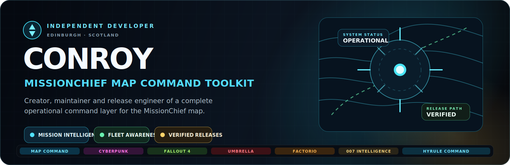
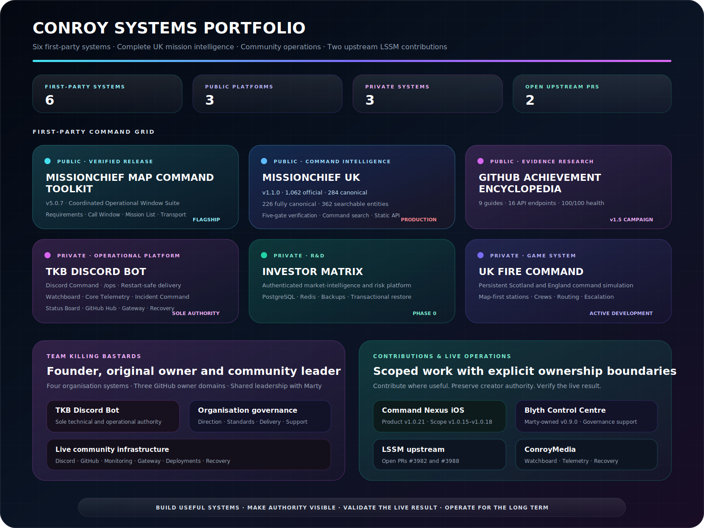
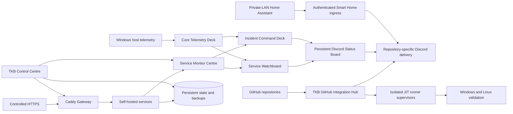
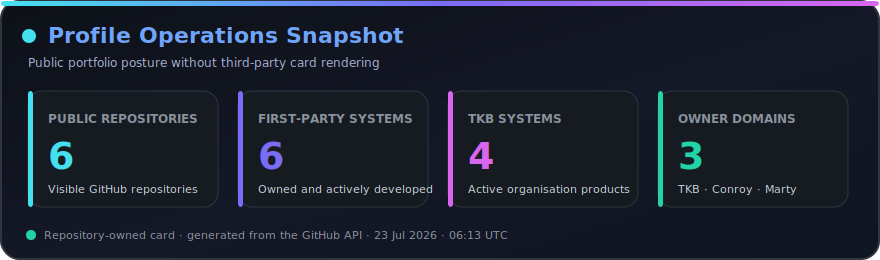
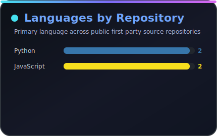
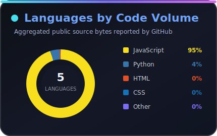
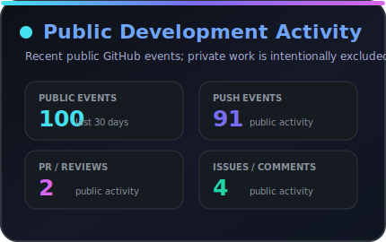
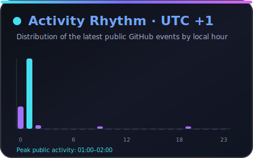

 

### I turn fragmented workflows into controlled, visible, recoverable systems.

**Operational software · Command intelligence · Community infrastructure · GitHub automation · Market intelligence · Persistent games · Self-hosting**

[**Portfolio**](#portfolio-command-board) · [**Public products**](#public-products) · [**Private systems**](#private-systems) · [**TKB**](#team-killing-bastards) · [**Contributions**](#contributions-and-project-support) · [**Infrastructure**](#conroymedia-and-self-hosting) · [**Activity**](#github-activity)

---

# About

I am **Conroy**, an operations-minded systems builder based in **Edinburgh, Scotland**.

My work normally begins where a process has become fragmented, repetitive, difficult to understand, or unsafe to maintain. I map the real workflow, identify the missing control layer, and build a system that makes the operation clearer, faster, more accountable, and easier to recover.

I work across product direction, software architecture, interface design, structured data, automation, release engineering, repository governance, technical documentation, deployment, networking, security boundaries, and live-system ownership.

My professional background in **office and operations management** directly shapes the way I build. Permissions, evidence, exception handling, ownership, deployment, backup, and recovery are product requirements—not final-stage polish.

<table>
<tr>
<td width="25%" align="center"><strong>⚙️ BUILD</strong> Convert operational friction into a usable control system.</td>
<td width="25%" align="center"><strong>🧭 CLARIFY</strong> Expose the information required for safer decisions.</td>
<td width="25%" align="center"><strong>🛡️ STABILISE</strong> Add validation, boundaries, evidence, and recovery.</td>
<td width="25%" align="center"><strong>◈ OPERATE</strong> Maintain the result as a live, accountable product.</td>
</tr>
</table>

---

# Portfolio Command Board

## Current responsibility map

| Domain | System | My responsibility |
|---|---|---|
| **Public operational product** | MissionChief Map Command Toolkit | Creator, maintainer, release authority, and production owner |
| **Public command-intelligence platform** | MissionChief UK | Creator, product owner, data/evidence authority, interface direction, validation, and publication |
| **Public research platform** | GitHub Achievement Encyclopedia | Creator, maintainer, research owner, and release authority |
| **Private operational platform** | TKB Discord Bot | Sole developer, security authority, deployment owner, and live operator |
| **Private research platform** | Investor Matrix | Project lead, Admin authority, architecture, and delivery direction |
| **Private game system** | UK Fire Command | Creator, product owner, architecture authority, and development lead |
| **Community and governance** | Team Killing Bastards | Founder, original owner, community leader, organisation governance, and technical direction |
| **Scoped userscript contribution** | MissionChief Command Nexus v1.0.15–v1.0.18 | Initiated and implemented the iOS Safari administration, station-workflow, and Mission Control layers with Marty's permission |
| **Project support** | Command Nexus; Blyth Control Centre | Repository, documentation, governance, and delivery support without claiming Marty-owned systems |
| **Open source** | LSSM V.4 PRs #3982 and #3988 | Two scoped upstream features submitted under upstream maintainer authority |
| **Infrastructure** | ConroyMedia | Docker, Caddy, networking, service monitoring, runners, backup, recovery, and private deployment operations |

## Six first-party systems

| System | Current state | Core purpose |
|---|---|---|
| **MissionChief Map Command Toolkit** | Verified `v5.0.7` | Operational Window Suite, live requirements intelligence, fleet identity, geographic command, transport assistance, finance, and seven interface systems |
| **MissionChief UK** | Production `v1.1.0` · Stage 34 complete · Static API v1.1.0 | Complete official UK mission catalogue, evidence-controlled canonical intelligence, instant command search, planning, and public data |
| **GitHub Achievement Encyclopedia** | Formal `v1.4.0` · active `v1.5.0` campaign | Evidence-led achievement research, guides, timelines, monitoring, and static API |
| **TKB Discord Bot** | Current `main` through Service Status Board and host-telemetry recovery | Discord command systems, community progression, operational monitoring, GitHub automation, gateway management, deployment, and recovery |
| **Investor Matrix** | Phase 0 | Authenticated market-intelligence and risk-control foundation with tested recovery |
| **UK Fire Command** | Active development | Persistent Scotland/England Fire and Rescue management game |

---

# Public Products

## MissionChief Map Command Toolkit

### A versioned operational-window and map-command platform for MissionChief

**Current verified release: `v5.0.7`**

Toolkit v5 moves beyond a requirements-only panel. It coordinates four mission-window families through one bounded lifecycle owner:

| Operational family | Current role |
|---|---|
| **Enhanced Operational Requirements** | Reconciles vehicles, equipment, personnel, trailers, selected units, en-route units, on-scene units, and remaining demand |
| **Extended Call Window** | Adds patient and vehicle summaries, selected/ARR counters, search, highlighting, generation context, keywords, and map controls |
| **Extended Mission List** | Adds sorting, starring, collapsing, patient/prisoner indicators, credit and time badges, and native sharing controls |
| **Enhanced Transport Requests** | Provides opt-in guarded transport assistance with exact-route validation, ambiguity rejection, and duplicate protection |

The requirements engine keeps **Covered**, **Open**, **Waiting**, and **Unresolved** states distinct. It scores native and compatible LSSM evidence sources, rebinds when MissionChief replaces the authoritative panel, suppresses genuinely visible duplicate interfaces, and fails closed when evidence is insufficient.

The wider platform retains:

- Mission Age Watch, Critical View, Mission Inspector, Major Incident Feed, Mission Spawn, and Stuck Detector
- Patient and prisoner transport monitoring plus controlled alliance Transport Sweep
- Specialist Own Vehicle Category badges without replacing native vehicle identity
- Resource Gap, fleet-code posture, vehicle loading, and visibility controls
- Heat maps, coverage rings, bookmarks, focus modes, and geographic command workflows
- Alliance mission value, session performance, payout presentation, and Financial Advisor reporting
- Seven complete interface systems across desktop, ultrawide, tablet, iPhone, and iPad
- automatic preservation of established Toolkit settings when upgrading from v4
- validated GitHub Release, Greasy Fork parity, stable manifests, checksums, Discord publication, and private recovery archives

### Current v5 production line

- **v5.0.0** introduced the coordinated Operational Window Suite.
- **v5.0.1–v5.0.3** recovered startup, isolated launcher bootstrap, and corrected a fatal preboot ordering defect.
- **v5.0.4** stopped missing evidence from appearing as confirmed green coverage.
- **v5.0.5** added authoritative native/LSSM source discovery, raw-data recovery, and rebinding.
- **v5.0.6** restored launcher lifecycle, typed settings, runtime mapping, and Mission Age labels.
- **v5.0.7** preserved collapsed command state, isolated child mission frames, and added one bounded same-origin mission-page recovery path.

Repository governance now inventories and enforces public-main write paths while moving dry-run, audit, and validation-candidate evidence into retained read-only Actions artefacts rather than committing transient output to `main`.

[Install](https://update.greasyfork.org/scripts/586018/MissionChief%20Map%20Command%20Toolkit.user.js) · [Repository](https://github.com/Conroy1988/missionchief-toolkit-assets) · [Documentation](https://conroy1988.github.io/missionchief-toolkit-assets/) · [Releases](https://github.com/Conroy1988/missionchief-toolkit-assets/releases)

## MissionChief UK

### Complete official UK mission coverage with evidence-controlled command intelligence

**Production release: `v1.1.0` · Stage 34 complete · Static API v1.1.0 · GitHub Pages live**

MissionChief UK now combines the complete official United Kingdom mission catalogue with conservative canonical records and an enforced five-gate verification programme.

| Intelligence domain | Current baseline |
|---|---:|
| Official UK missions | **1,062** |
| Canonical mission records | **284** |
| Official/canonical exact-ID matches | **267** |
| Fully canonical missions | **226** |
| Official records awaiting a canonical record | **795** |
| Canonical-only overlays | **17** |
| Deployable resources | **48** |
| Buildings and extensions | **18** |
| Qualifications | **12** |
| Canonical searchable entities | **362** |

Every official mission progresses through **Captured**, **Identity verified**, **Requirements mapped**, **Operationally verified**, and **Fully canonical** gates. Unknown game fields remain visible instead of being guessed.

### Operational capability

- Complete Mission Lookup across all 1,062 official records and the canonical data estate
- Global **`Ctrl+K` / `⌘K` / `/` command palette** across the complete site
- Live verification-status interface exposing each mission's gate, blockers, and next action
- Collection filtering and deep links into Mission Lookup and the Query Catalogue
- Resource and qualification comparison
- Concurrent Fleet Planner for repeated incident demand
- Natural-language Query Catalogue
- Versioned canonical, official, verification, manifest, search-index, FAQ, and OpenAPI data surfaces
- Strict schema, relationship, range, release, evidence, documentation-link, and built-site validation
- Chromium, Firefox, iPhone WebKit, and iPad WebKit acceptance coverage
- Responsive intelligence tools, viewport-overflow protection, critical WCAG A/AA scanning, and retained failure diagnostics

The public tools are browser-side and read-only. They do not authenticate against, access, or modify a MissionChief account.

[Command Centre](https://conroy1988.github.io/MissionChief-UK/) · [Mission Lookup](https://conroy1988.github.io/MissionChief-UK/tools/mission-lookup/) · [Verification Status](https://conroy1988.github.io/MissionChief-UK/reference/mission-verification-status/) · [Fleet Planner](https://conroy1988.github.io/MissionChief-UK/tools/fleet-planner/) · [Static API](https://conroy1988.github.io/MissionChief-UK/api/) · [Repository](https://github.com/Conroy1988/MissionChief-UK)

## GitHub Achievement Encyclopedia

### Evidence-led research into GitHub profile achievements

**Formal release: `v1.4.0` · Active campaign: `v1.5.0` · Health: `100/100`**

The Encyclopedia keeps official documentation, reproduced behaviour, historical evidence, account observations, community reports, contradictions, and uncertainty separate and reviewable.

- Nine canonical guides: seven active and two retired
- Sixteen public static API endpoints
- Seventeen-control unified repository audit
- 220 tracked Markdown files and 88 external source URLs
- Official-document fingerprint monitoring
- Privacy-safe evidence records and verification timelines
- Campaign-classified research tasks
- Searchable GitHub Pages experience

[Explore](https://conroy1988.github.io/Achievements/) · [Repository](https://github.com/Conroy1988/Achievements) · [Evidence](https://github.com/Conroy1988/Achievements/blob/main/docs/evidence-register.md) · [Research](https://github.com/Conroy1988/Achievements/blob/main/docs/research-hub.md)

---

# Private Systems

## TKB Discord Bot

**Sole developer · Maintainer · Security and operational authority**

The TKB Discord Bot is the private operational backbone of the Team Killing Bastards Discord, GitHub estate, and ConroyMedia monitoring environment.

### Community command platform

- Levels 2.1 with one million titles, challenges, streaks, seasons, squads, campaigns, badges, and audited special titles
- requester-bound **`/tkb` Command Centre** and expanded persistent community command board
- owner-only **`/ops` console** with bounded operational evidence and exact-confirmation controls
- mandatory per-category Discord channel routing with optional member DM copies
- restart-safe notification delivery, persistent evidence, bounded retry, and source-channel level-up announcements
- moderation logging, immutable case management, scheduling, starboard, Battlefield, AI, media, and community automation

### ConroyMedia operations layer

- configurable Service Monitor Centre with scheduled checks, anti-flapping states, bounded history, incident routing, cooldown grouping, and retries
- fullscreen retro **Service Watchboard** with automatic monitor discovery, kiosk layouts, incremental heartbeats, and wake-lock support
- **Core Telemetry Deck** with bounded Windows host CPU, RAM, uptime, storage, and container posture
- automatic **Incident Command Deck** takeover for active service, host-resource, and monitoring-plane incidents
- one persistent Discord **Service Status Board** with restart recovery, state-change coalescing, incident posture, and optional host metrics
- recovered native/CIM Windows RAM and fixed-drive telemetry with per-metric isolation and bounded last-known-good retention

### Secured infrastructure and integration

- FastAPI **Control Centre 2.0** with authenticated workspaces and protected unsaved form state
- transactional SQLite state and encrypted credentials
- managed Caddy HTTPS Gateway with validation, adoption, rollback, reconciliation, and interrupted-operation recovery
- backup, update, restore, automatic rollback, and restricted host-agent evidence
- private-LAN Smart Home ingress with encrypted Home Assistant credentials, server-side mappings, replay protection, and fixed Discord alert plans
- separate Team-Killing-Bastards, Conroy1988, and MartyBlyth GitHub workspaces
- GitHub Apps, signed webhooks, repository-specific Discord delivery, dead letters, workflow evidence, controlled retry/reconciliation, and audited sign-off
- Linux and Windows trust-scoped ephemeral JIT runners with non-admin and no-Docker-daemon verification

The application container still receives no raw Docker socket or unrestricted host-command access. Smart Home does not expose generic Home Assistant service calls, public ingress, camera streams, or arbitrary device control.

[🔒 Private repository](https://github.com/Team-Killing-Bastards/TKB-Discord-Bot)

## Investor Matrix

**Project lead · Admin authority · Technical direction**

Investor Matrix is a private market-intelligence and risk-control platform currently at **Phase 0**.

- Next.js command centre and FastAPI API
- PostgreSQL users, sessions, audit events, and Alembic migrations
- Redis-backed dependency readiness
- Fixed Admin and Member boundaries
- Argon2 authentication, HTTP-only sessions, CSRF protection, throttling, and lockout
- Active-session control and filtered audit history
- Admin-only fast-forward GitHub updater
- SHA-256-verified PostgreSQL backups and transactional restoration

Market ingestion, portfolio accounting, risk analytics, backtesting, and explainable signals remain gated behind later phases.

[🔒 Private repository](https://github.com/Team-Killing-Bastards/Investor-Matrix)

## UK Fire Command

**Creator · Product owner · Architecture authority**

UK Fire Command is a private, persistent, map-first Fire and Rescue Service management game.

- Isolated commander accounts
- Scotland and England operating regions
- Persistent station placement, upgrades, appliances, and qualified crews
- Relaxed, Standard, and Demanding incident tempos
- Five UK-local demand periods and time-weighted incident mixes
- Real-road OSRM routing and animated appliance travel
- Incident escalation, immutable credit transactions, and fleet maintenance
- Responsive desktop, tablet, mobile, and installable web-app behaviour

**Architecture:** Next.js, NestJS, PostgreSQL/PostGIS, MapLibre, OpenFreeMap, OSRM, persistent workers, and Docker Compose.

[🔒 Private repository](https://github.com/Conroy1988/uk-fire-command)

---

# Team Killing Bastards

I **founded and originally created [Team Killing Bastards](https://github.com/Team-Killing-Bastards)**, a Scottish-run gaming community whose software, automation, game tooling, research, and infrastructure are maintained through GitHub.

I retain founder and original-owner responsibility for the community's identity, governance, direction, and long-term stewardship. I lead TKB alongside **[MartyBlyth](https://github.com/Martyblyth)**, my right-hand and fellow community leader.

| Organisation system | Technical authority | My role |
|---|---|---|
| **TKB Discord Bot** | Conroy1988 | Sole developer, maintainer, security authority, and operator |
| **Investor Matrix** | Conroy1988 | Project lead, Admin authority, and delivery owner |
| **MissionChief Command Nexus** | MartyBlyth | Project helper; current product v1.0.21; scoped v1.0.15–v1.0.18 iOS Safari contributor |
| **Blyth Control Centre** | MartyBlyth | Organisation governance and portfolio support |

Community leadership is shared. Technical ownership, credentials, data, deployment authority, and release control remain explicit for every system.

---

# Contributions and Project Support

## MissionChief Command Nexus — iOS Safari compatibility

**Current production version: `1.0.21` · Mission Finder engine: `V10.6.86`**

Command Nexus is **MartyBlyth's project**. He remains its creator, principal userscript author, technical owner, and release authority.

I identified that the shared Unit, Station and Personnel workflow did not operate correctly on the iPhone and iPad Safari devices I use. I initiated the compatibility project, asked Marty for permission to contribute, and implemented the scoped work after he approved access.

My contribution remains deliberately bounded to:

- **v1.0.15** — responsive iOS station-list detection, iPhone/iPad desktop-site handling, safe-area and visual-viewport positioning, touch dragging, and station iframe fallback
- **v1.0.16** — single-menu enforcement after duplicate injection, Safari bfcache restoration, and page-fragment replacement
- **v1.0.18** — dedicated iOS Safari Mission Control layout with safe-area positioning, mobile-width panel stacking, internal scrolling, pointer dragging, and independent collapse behaviour without changing desktop Mission Control

The current v1.0.21 product additionally contains Marty's Fire cross-reference mappings and Mission Finder V10.6.86 work. Those later product changes do not expand my scoped authorship claim.

[Repository](https://github.com/Team-Killing-Bastards/MissionChief-Command-Nexus) · [Install](https://greasyfork.org/en/scripts/587702-missionchief-command-nexus) · [Changelog](https://github.com/Team-Killing-Bastards/MissionChief-Command-Nexus/blob/main/CHANGELOG.md)

## Blyth Control Centre

**Current version: `0.9.0`**

Blyth Control Centre is Marty's private household and infrastructure command surface. Its current release line includes:

- detailed downstairs and upstairs floorplans with live room overlays;
- Home Assistant, Hive, weather, energy, printer-energy, Synology, and media intelligence;
- UniFi gateway, switch, access-point, Wi-Fi, and client reporting;
- a dedicated Printers tab for X2D, H2D, and P1S energy data;
- container health, restart, update, immutable GHCR restore, and persistent audit controls through an opt-in NAS deployment agent;
- hourly LibreSpeed WAN tests with retained download, upload, latency, jitter, reliability, Day/Week/Month/Year history, manual testing, detailed reports, and CSV export; and
- hardened Synology Docker delivery with server-side credentials and controlled external access.

**MartyBlyth is the creator, project owner, and primary developer.** My role is organisation governance and portfolio support.

[🔒 Private repository](https://github.com/Team-Killing-Bastards/blyth-control-centre)

## Open Source and Upstream Work

I currently have **two open and mergeable upstream LSSM V.4 pull requests**. Both are scoped contributions submitted to the upstream maintainers; neither changes LSSM ownership or release authority.

| Pull request | Contribution | Current scope |
|---|---|---|
| [**#3982 — Optional monospaced notes**](https://github.com/LSS-Manager/LSSM-V.4/pull/3982) | Implements issue #2906 | Adds an opt-in `noteMonospace` setting for the native and redesigned note editor/preview, disabled by default, with documentation and localisation across ten supported locales |
| [**#3988 — Alliance member role filters**](https://github.com/LSS-Manager/LSSM-V.4/pull/3988) | Implements issue #2271 | Adds a new Alliance member-list module with sequential load-all-pages, de-duplication, role and online/offline filters, original/name/role/activity sorting, ascending/descending control, documentation, and four locales |

Both pull requests remain under upstream review. The upstream project retains full ownership, merge authority, translation review, and release control. My `LSSM-V.4` and `RED4ext` repositories remain forks/reference workspaces—not first-party products.

---

# ConroyMedia and Self-Hosting

ConroyMedia is a working home-lab environment used to operate and test real deployment, networking, monitoring, integration, and recovery workflows.

- Docker-hosted services and persistent storage
- Caddy reverse proxying and managed HTTPS routes
- DDNS and controlled remote access
- Emby and media automation services
- scheduled service monitoring with anti-flapping state and Discord incident delivery
- fullscreen Service Watchboard, Core Telemetry, automatic Incident Command, and a persistent Discord status board
- bounded Windows CPU, RAM, uptime, fixed-drive, and container telemetry
- Windows and Linux administration
- GitHub App, webhook, runner, and workflow integration testing
- backup, restore, rollback, and disaster-recovery exercises
- private application deployment and bounded internet exposure
- sanitised real-hardware and Home Assistant compatibility work

This is a live operational environment. Deployment, health, routing, monitoring, telemetry, backup, recovery, and integration claims are expected to survive real use.

---

# Technical Stack

---

# Live Operations Board

| System | Release / state | Current posture |
|---|---|---|
| **Map Command Toolkit** |  | v5.0.7 · Operational Window Suite · authoritative native/LSSM evidence · artifact-only validation and audit evidence |
| **MissionChief UK** |  | v1.1.0 · 1,062 official missions · 284 canonical · 226 fully canonical · 362 canonical entities |
| **Achievement Encyclopedia** |  | v1.5.0 campaign · 9 guides · 16 API endpoints · 100/100 health |
| **Command Nexus** |  | Marty-owned v1.0.21 · Conroy scoped iOS Safari work remains v1.0.15–v1.0.18 |
| **TKB Discord Bot** | Private | Discord Command Centre · `/ops` · restart-safe notifications · Watchboard · Core Telemetry · Incident Command · Discord Status Board · GitHub Hub · Gateway |
| **Investor Matrix** | Private | Phase 0 · authenticated · backed up · recoverable |
| **UK Fire Command** | Private | Persistent Scotland/England command loop |
| **Blyth Control Centre** | Private | Marty-owned v0.9.0 · home/energy/media · guarded operations · UniFi · hourly Network Operations |
| **LSSM contribution #1** | [PR #3982](https://github.com/LSS-Manager/LSSM-V.4/pull/3982) | Open and mergeable · optional monospaced native/redesigned note editing and preview |
| **LSSM contribution #2** | [PR #3988](https://github.com/LSS-Manager/LSSM-V.4/pull/3988) | Open and mergeable · Alliance member loading, role/activity filters, and sorting |

---

# GitHub Activity

The five primary cards are generated daily inside this repository from GitHub's API. Private repositories, private runner work, and some organisation contributions remain intentionally outside public statistics.

---

# Away From the Repository

I am usually somewhere around PC gaming, self-hosted infrastructure, interface concepts, music experiments, or another piece of technology that has decided it needs diagnosing.

Development is routinely supervised by **Eli and Nala**, who contribute no code but maintain strict control over keyboard availability. 🐈‍⬛🐈

---

## Conroy1988

### Build useful systems. Operate them seriously. Improve them with evidence.

**Software · Automation · Operations · Command intelligence · Research · Game systems · Community infrastructure**

Personal projects and community systems are developed independently from the third-party platforms they extend or reference. Product names and trademarks remain the property of their respective owners.

