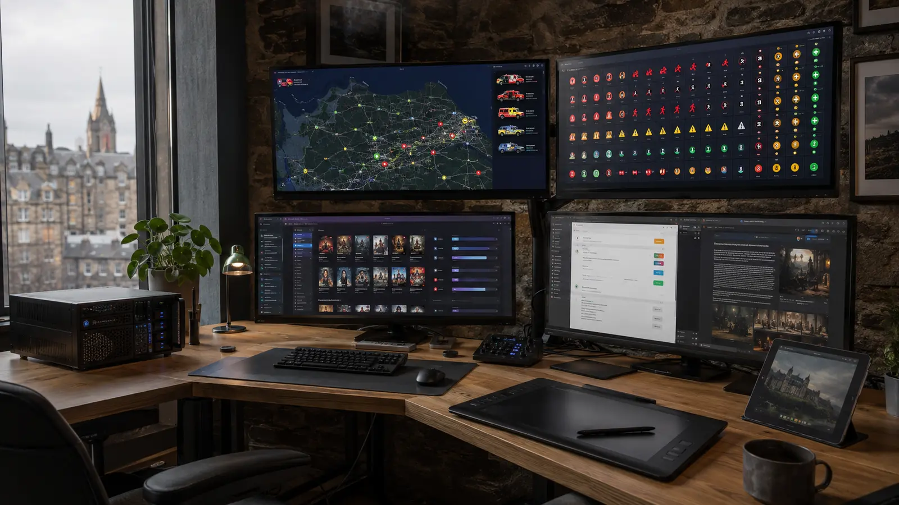
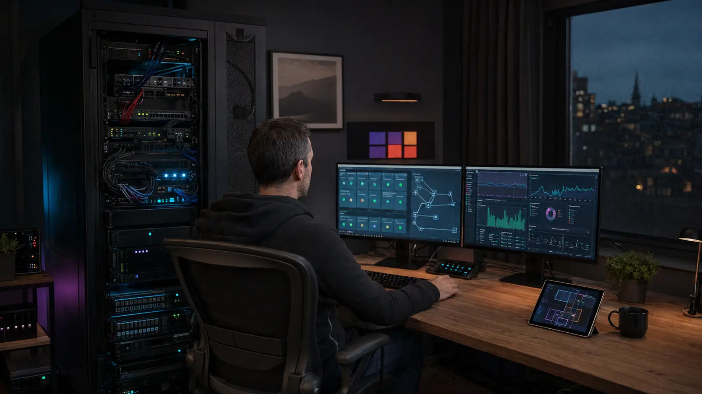
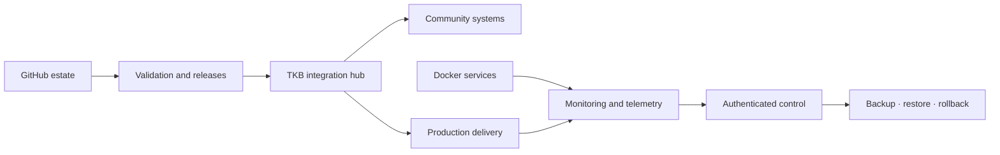
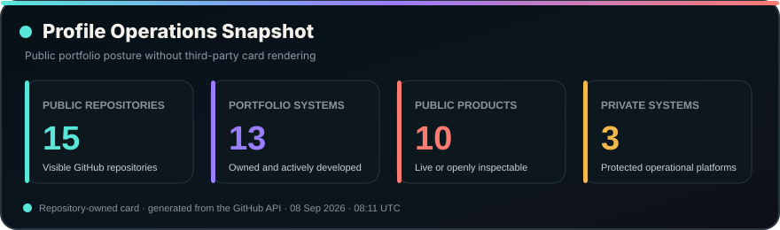
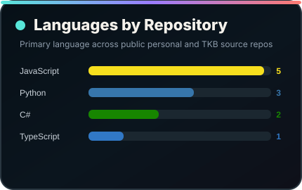
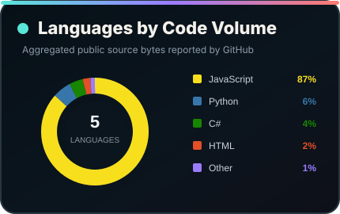
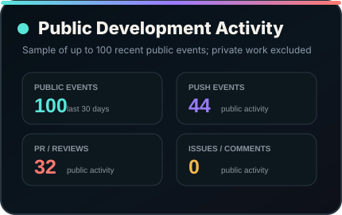
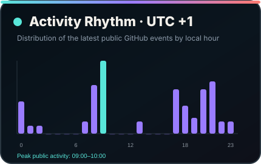

# Daniel Conroy

<h2>I build ambitious systems—and stay to operate them.</h2>

<strong>Independent systems architect · Product builder · Founder of Team Killing Bastards · Edinburgh, Scotland</strong>

[**Portfolio**](#portfolio-at-a-glance) · [**TKB**](#01--the-tkb-estate) · [**MissionChief**](#02--missionchief-command-suite) · [**Products**](#03--independent-products) · [**Private systems**](#04--private-operational-systems) · [**Collaboration**](#collaboration-with-clear-credit) · [**Activity**](#github-activity)

<table>
<tr>
<td width="50%" align="center"><a href="https://tkb-gaming.scot/"><strong>EXPLORE TKB GAMING</strong> Community, guides and public products</a></td>
<td width="50%" align="center"><a href="https://tkb-gaming.scot/mission-chief-scripts/map-command-toolkit/"><strong>INSTALL MAP COMMAND TOOLKIT</strong> Official supported distribution</a></td>
</tr>
<tr>
<td width="50%" align="center"><a href="https://www.missionchief.co.uk/vehicle_graphics/5897"><strong>USE THE ANIMATED UK FLEET</strong> Complete MissionChief UK vehicle pack</a></td>
<td width="50%" align="center"><a href="https://www.missionchief.co.uk/mission_graphics/539"><strong>USE THE RESPONSE ICONS</strong> Mission markers with permanent response levels</a></td>
</tr>
</table>

---

## The builder

I am **Daniel Conroy**, an independent builder based in **Edinburgh, Scotland**.

I turn fragmented workflows into systems people can understand and trust: public products, deep game guides, browser tools, community automation, private intelligence platforms and the infrastructure underneath them. My work spans product direction, interface design, architecture, implementation, validation, deployment and live operation.

The domains change. The operating doctrine does not.

| Discover | Design |
| --- | --- |
| Map the real workflow, its evidence and its failure points. | Make complex state legible, responsive and worth using. |
| **Control** | **Operate** |
| Keep authority, safety boundaries and recovery visible. | Own the result after launch day—not just the first build. |

---

## Portfolio at a glance

The portfolio has **ten first-party systems**: seven public products and three private operational platforms. Collaborations, upstream contributions, forks and archived source history are kept outside that ownership count.

| Public product | Scope and role |
| --- | --- |
| **[TKB Gaming](https://tkb-gaming.scot/)** | Community and publishing estate for the TKB website, game guides and supported scripts. **Founder · Co-owner · Product and operations direction** |
| **[MissionChief Map Command Toolkit](https://github.com/Conroy1988/missionchief-toolkit-assets)** | Responsive command layer for mission, fleet, map, transport and financial intelligence. **Creator · Product designer · Maintainer · Release authority** |
| **[TKB UK Emergency Fleet — Animated](https://github.com/Conroy1988/missionchief-uk-animated-graphics)** | Complete original UK emergency-services vehicle graphics for MissionChief. **Creator · Product direction · Maintainer** |
| **[UK Emergency Response Icons Reborn 2026](https://github.com/Conroy1988/UK-Emergency-Response-Icons-Reborn-2026)** | Complete mission-marker system with native states and permanent TKB Response Levels. **Creator · Product direction · Maintainer** |
| **[GitHub Achievement Encyclopedia](https://conroy1988.github.io/Achievements/)** | Evidence-led reference, research system and static API for GitHub profile achievements. **Creator · Research owner · Maintainer** |
| **[Auto Page Translator for Brave](https://github.com/Conroy1988/Brave-Auto-Page-Translator)** | Privacy-first, rule-driven translation inside the original webpage. **Creator · Product designer · Maintainer** |
| **[Emby Best Episodes](https://github.com/Conroy1988/Emby-Best-Episodes)** | Server plugin that creates rating-sorted season playlists without changing Emby metadata. **Creator · Product owner · Maintainer** |

| Private system | Scope and role |
| --- | --- |
| **TKB Discord Bot and ConroyMedia Operations** | Community progression, administration, GitHub integration, telemetry, monitoring, gateways and controlled recovery. **Technical owner · Security authority · Live operator** |
| **Investor Matrix** | Self-hosted market intelligence, portfolio accounting, risk control and explainable decision support. **Project lead · Admin authority · Architecture and delivery direction** |
| **UK Fire Command** | Persistent map-first Fire and Rescue Service management game with real-road response and server-authoritative operations. **Creator · Product owner · Architecture authority** |

The machine-readable ownership register lives in [`data/portfolio.json`](data/portfolio.json) and drives the generated portfolio metrics below.

---

## 01 · The TKB estate

### [Team Killing Bastards](https://tkb-gaming.scot/) · community, publishing and operations

I founded and originally created **Team Killing Bastards** and now lead its identity, technical direction and long-term stewardship alongside [MartyBlyth](https://github.com/Martyblyth).

The current estate brings the main community site, game intelligence, browser products and operational systems into one governed platform. The production monorepo remains private; the finished public surfaces remain open to everyone.

| Guide or surface | Mission |
| --- | --- |
| **[Crimson Desert Guide](https://tkb-gaming.scot/games/crimson-desert/guides/)** | Evidence-led, patch-aware field guide to Pywel, its systems, quests and world. |
| **[Eco Guide](https://tkb-gaming.scot/games/eco/guides/)** | Versioned guide and world database for civilisation, industry, government and the meteor clock. |
| **DrainSim Guide** | Mission, equipment and troubleshooting intelligence maintained inside the TKB production estate. |
| **[MissionChief UK Command Centre](https://tkb-gaming.scot/games/missionchief/guides/)** | Searchable missions, units, stations, training, fleet planning and emergency-service operations. |
| **[MissionChief Scripts](https://tkb-gaming.scot/mission-chief-scripts/)** | Supported product channel for TKB MissionChief browser tools. |

The original standalone Crimson Desert and MissionChief repositories are preserved as archived source history. Their maintained successors live inside the TKB Website estate, with provenance and migration records intact.

---

## 02 · MissionChief command suite

Three complementary products now cover the decision layer, the moving fleet and the incident map.

### [MissionChief Map Command Toolkit](https://github.com/Conroy1988/missionchief-toolkit-assets)

The Toolkit turns MissionChief's scattered signals into one responsive command environment: incident priority, fleet state, transport demand, map intelligence, resource pressure, financial reconciliation, diagnostics and safe recovery.

It keeps MissionChief authoritative. The product surfaces the signal, reaches the correct native control and fails closed when evidence is incomplete.

[**Install or update**](https://tkb-gaming.scot/mission-chief-scripts/map-command-toolkit/) · [**Open the field guide**](https://conroy1988.github.io/missionchief-toolkit-assets/) · [**Explore eight interfaces**](https://conroy1988.github.io/missionchief-toolkit-assets/themes/) · [**Inspect release control**](https://github.com/Conroy1988/missionchief-toolkit-assets/blob/release-state/status/README.md)

### [TKB UK Emergency Fleet — Animated](https://github.com/Conroy1988/missionchief-uk-animated-graphics)

A complete, original UK emergency-services vehicle pack with static and animated map assets, independent emergency-light rhythms, helicopter rotor movement, specialist silhouettes and automated visibility tests across light, dark, grayscale and satellite-style maps.

[**Preview the complete fleet**](https://github.com/Conroy1988/missionchief-uk-animated-graphics/blob/main/GALLERY.md) · [**Use pack 5897 in MissionChief**](https://www.missionchief.co.uk/vehicle_graphics/5897)

### [UK Emergency Response Icons Reborn 2026](https://github.com/Conroy1988/UK-Emergency-Response-Icons-Reborn-2026)

A compact mission-marker system for the complete mapped UK mission catalogue. Each incident receives a permanent **TKB Response Level 1–5**, while MissionChief's native red, amber and green states communicate live progress independently.

[**Browse every mission slot**](https://github.com/Conroy1988/UK-Emergency-Response-Icons-Reborn-2026/blob/main/GALLERY.md) · [**Use pack 539 in MissionChief**](https://www.missionchief.co.uk/mission_graphics/539)

---

## 03 · Independent products

### [GitHub Achievement Encyclopedia](https://conroy1988.github.io/Achievements/)

An evidence-led reference that separates official documentation, reproduced behaviour, historical records, community claims and unknowns. Human-readable guides sit beside privacy-safe evidence records, verification timelines, bounded research tasks and a validated static API.

[**Explore the encyclopedia**](https://conroy1988.github.io/Achievements/) · [**Search the research**](https://conroy1988.github.io/Achievements/search/) · [**Inspect the evidence register**](https://github.com/Conroy1988/Achievements/blob/main/docs/evidence-register.md) · [**Use the static API**](https://github.com/Conroy1988/Achievements/blob/main/docs/api-reference.md)

### [Auto Page Translator for Brave](https://github.com/Conroy1988/Brave-Auto-Page-Translator)

A privacy-conscious Manifest V3 extension for Brave and Chromium. It translates readable text inside the original page, preserves the real site's session and interactive state, and restores the original content in one action.

Manual/minimal-access mode is the default. Approved-site automation, per-site targets, live-page updates, glossaries and provider choices remain explicit and testable—with no analytics or developer-operated translation server.

[**Install from the Chrome Web Store**](https://chromewebstore.google.com/detail/auto-page-translator-for/pilpighhgdglgngmakjepoadacbhpoeo) · [**Inspect the public source**](https://github.com/Conroy1988/Brave-Auto-Page-Translator)

### [Emby Best Episodes](https://github.com/Conroy1988/Emby-Best-Episodes)

An Emby Server plugin that builds best-rated playlists for each TV season without changing season order, episode metadata, ratings or watched state. It can rank one show, several selected shows or the full visible library, then refresh after scans or on a schedule.

[**Open the repository**](https://github.com/Conroy1988/Emby-Best-Episodes) · [**Read the Emby community release thread**](https://emby.media/community/topic/148991-plugin-best-episodes-%E2%80%93-highest-rated-episode-playlists-by-season/)

---

## 04 · Private operational systems

These systems are private by design. Credentials, deployment topology, member data, market records and recovery material stay outside this public page.

### TKB Discord Bot and ConroyMedia Operations

The private operational backbone for TKB: community progression, administration, GitHub integration, service monitoring, host telemetry, incident correlation, HTTPS gateways, controlled deployment and evidence-backed recovery.

**My role:** Technical owner · Maintainer · Security authority · Live operator

### Investor Matrix

A self-hosted market-intelligence and portfolio-accounting platform spanning US and UK market data, explainable research prioritisation, immutable transactions, exact-decimal positions and P&L, human-controlled risk decisions, auditing and verified deployment.

**My role:** Project lead · Admin authority · Architecture and delivery direction

### UK Fire Command

A persistent map-first Fire and Rescue Service management game. Commanders build stations, purchase appliances, train crews, mobilise qualification-valid resources over real roads, manage escalation and maintain an authoritative operational estate across Scotland or England.

**My role:** Creator · Product owner · Architecture authority

---

## Collaboration with clear credit

Good collaboration should make ownership clearer, not blur it.

### [MissionChief Command Nexus](https://github.com/Team-Killing-Bastards/MissionChief-Command-Nexus)

**MartyBlyth is the developer, creator, principal userscript author, technical owner and release authority. Command Nexus remains Marty's project.**

I am the **project helper** for repository infrastructure, documentation, validation and general operations. With Marty's permission, I also contributed the scoped iOS Safari compatibility work. The Resource Administration and Mission Finder engines remain Marty's work.

### Marty-owned systems

I provide organisation, portfolio and delivery support across **Blyth Control Centre** and **Blyth Crypto Paper Bot**. Marty remains their creator, project owner and primary technical authority.

### LSSM V.4 · upstream contributions

My public LSSM fork is a contribution workspace—not a first-party product. Changes remain under upstream maintainer authority.

| Pull request | Contribution |
| --- | --- |
| [**#3982**](https://github.com/LSS-Manager/LSSM-V.4/pull/3982) | Optional monospaced notes across native and redesigned editors, documentation and supported locales. |
| [**#3988**](https://github.com/LSS-Manager/LSSM-V.4/pull/3988) | Complete alliance-member loading plus role, activity and local sorting controls. |

The current review and merge state is deliberately left to each live pull-request page rather than hard-coded here.

---

## ConroyMedia

**ConroyMedia** is the live self-hosted environment where architecture meets operating reality.

It connects Docker services, Caddy routing, DDNS, media automation, service monitoring, Windows telemetry, GitHub Apps and isolated runners, Home Assistant integrations, deployment controls, backups and tested recovery paths.

```mermaid
flowchart LR
    Code[GitHub estate] --> Gate[Validation and releases]
    Gate --> Hub[TKB integration hub]
    Hub --> Community[Community systems]
    Hub --> Deploy[Production delivery]
    Services[Docker services] --> Observe[Monitoring and telemetry]
    Deploy --> Observe
    Observe --> Control[Authenticated control]
    Control --> Recover[Backup · restore · rollback]
```

> A system is not operational because it started once. It is operational when it can explain its state, limit its authority and survive failure.

---

## Working stack

---

## GitHub activity

Repository-owned cards are regenerated from GitHub's API. Private work and some organisation activity remain intentionally outside public statistics.

---

## Project history and contribution workspaces

<strong>Archived source, predecessors and non-product repositories</strong>

 

- [`Crimson-Desert-Guide`](https://github.com/Conroy1988/Crimson-Desert-Guide) — archived source history; maintained successor is the TKB Website estate.
- [`MissionChief-UK`](https://github.com/Conroy1988/MissionChief-UK) — archived source history; maintained successor is the TKB Website estate.
- [`LSSM-V.4`](https://github.com/Conroy1988/LSSM-V.4) — public fork used for upstream contribution work.
- `missionchief-map-command-toolkit-private` — private recovery authority, not a second public product.
- `Brave-Auto-Translation` — retired predecessor to Auto Page Translator for Brave.
- `RED4ext` — third-party fork, not presented as original work.

---

## Beyond the build

Usually: PC gaming, Linux and handheld tinkering, self-hosted infrastructure, interface concepts, game worlds or cinematic music experiments.

Development is supervised by **Eli and Nala**, who contribute no code but retain decisive control over keyboard availability.

---

### Build useful systems. Make authority visible. Operate for the long term

Independent projects and community systems. Third-party product names and trademarks remain the property of their respective owners.

