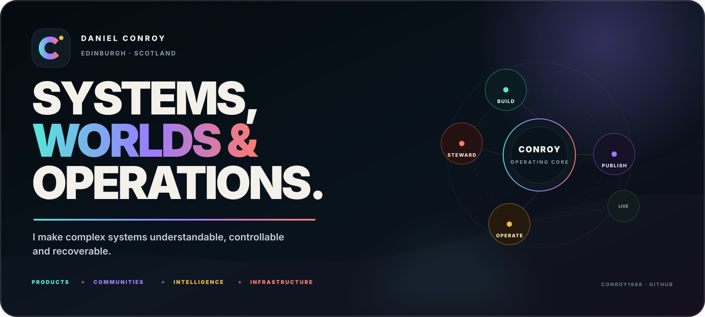
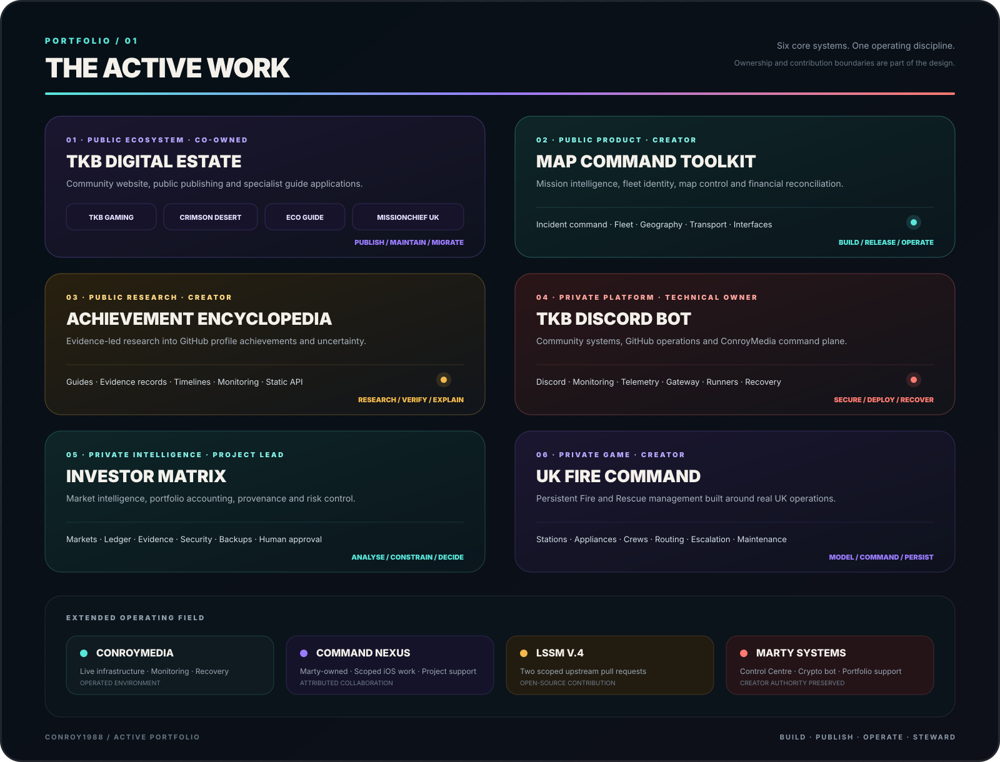
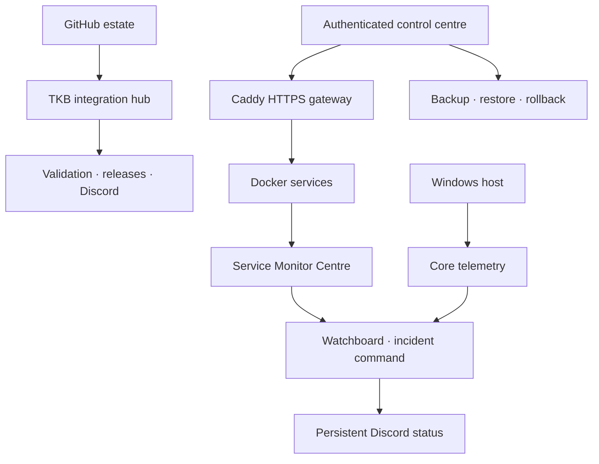

 

### I build the control layer between complex systems and the people who need to trust them.

**Products · Communities · Intelligence · Automation · Games · Infrastructure**

[**Portfolio**](#portfolio-architecture) · [**Work index**](#work-index) · [**TKB**](#team-killing-bastards) · [**Collaboration**](#collaboration-with-clear-credit) · [**Infrastructure**](#conroymedia) · [**Activity**](#github-activity)

---

## About

I am **Daniel Conroy**, an operations-minded builder based in **Edinburgh, Scotland**.

My projects tend to begin where something useful has become fragmented: too many interfaces, unclear ownership, missing evidence, fragile releases, or no safe route back when something fails. I turn that friction into products and platforms that are easier to understand, operate and recover.

I work across product direction, interface design, software architecture, structured data, automation, release engineering, repository governance, deployment and live operations. My background in office and operations management is not separate from the technical work—it is the reason permissions, clarity, evidence and recovery are treated as product features.

<table>
<tr>
<td width="25%" align="center"><strong>01 · DISCOVER</strong> Map the real workflow, not the imagined one.</td>
<td width="25%" align="center"><strong>02 · DESIGN</strong> Make complex state legible and useful.</td>
<td width="25%" align="center"><strong>03 · CONTROL</strong> Build boundaries, evidence and recovery.</td>
<td width="25%" align="center"><strong>04 · OPERATE</strong> Own the result after launch day.</td>
</tr>
</table>

---

## Portfolio Architecture

The portfolio is deliberately broad, but the operating idea is consistent: **make complicated systems understandable without hiding their risk, evidence or ownership**.

---

## Work Index

### TKB digital estate

<table>
<tr>
<td width="64%" valign="top">

#### [Team Killing Bastards](https://github.com/Team-Killing-Bastards) · community and product ecosystem

I founded and originally created **Team Killing Bastards** and continue to lead its community identity, governance and technical direction alongside [MartyBlyth](https://github.com/Martyblyth).

The current digital estate brings the public website, specialist game guides, community automation and private operational platforms under one maintained ecosystem.

- **[TKB Gaming](https://tkb-gaming.scot/)** — community website and public product gateway
- **[Crimson Desert Guide](https://tkb-gaming.scot/games/crimson-desert/guides/)** — evidence-led, patch-aware field guide to Pywel
- **[Eco Guide](https://tkb-gaming.scot/games/eco/guides/)** — versioned guide and world database within the TKB platform
- **[MissionChief UK Guide](https://www.tkb-gaming.scot/games/missionchief/guides/)** — the complete UK operations-intelligence guide, tools and data estate

</td>
<td width="36%" valign="top">

**ROLE**

Founder · Community leader · Co-owner of the TKB Website monorepo · Product and operations direction

**PLATFORM**

Static parent site · Astro applications · guarded cPanel deployment · migration-preserved history · independent validation gates

**STATE**

Active private monorepo with public production surfaces

</td>
</tr>
</table>

### Public products

<table>
<tr>
<td width="50%" valign="top">

#### [MissionChief Map Command Toolkit](https://github.com/Conroy1988/missionchief-toolkit-assets)

An operational command layer for MissionChief that connects incident awareness, fleet readability, map intelligence, selected transport workflows and financial reconciliation.

**My role:** Creator · Maintainer · Release authority · Production owner

[Install](https://update.greasyfork.org/scripts/586018/MissionChief%20Map%20Command%20Toolkit.user.js) · [Guide](https://conroy1988.github.io/missionchief-toolkit-assets/) · [Release control](https://github.com/Conroy1988/missionchief-toolkit-assets/tree/main/status)

</td>
<td width="50%" valign="top">

#### [GitHub Achievement Encyclopedia](https://github.com/Conroy1988/Achievements)

An evidence-led reference for GitHub profile achievements that keeps official documentation, reproduced behaviour, historical evidence, observations and uncertainty visibly separate.

**My role:** Creator · Research owner · Maintainer · Release authority

[Explore](https://conroy1988.github.io/Achievements/) · [Evidence register](https://github.com/Conroy1988/Achievements/blob/main/docs/evidence-register.md) · [Research hub](https://github.com/Conroy1988/Achievements/blob/main/docs/research-hub.md)

</td>
</tr>
</table>

### Private systems

| System | What it is | My responsibility |
|---|---|---|
| **TKB Discord Bot** | The private operational backbone for TKB community systems, progression, administration, GitHub integration, service monitoring, gateways and recovery | Sole technical owner, maintainer, security authority and live operator |
| **Investor Matrix** | A self-hosted market-intelligence, portfolio-led accounting and risk-control platform that keeps evidence, uncertainty and human authority visible | Project lead, Admin authority, architecture and delivery direction |
| **UK Fire Command** | A persistent, map-first Fire and Rescue Service management game with stations, appliances, trained crews, real-road response and incident escalation | Creator, product owner and architecture authority |

These systems are private by design. Their public description is intentionally limited; operational credentials, deployment details, user data and recovery material remain outside this profile.

---

## Team Killing Bastards

TKB is more than a GitHub organisation. It is the community, publishing identity and operational home connecting the work above.

| Domain | Current responsibility |
|---|---|
| **Community** | Identity, direction, governance and long-term stewardship |
| **Publishing** | TKB Gaming, game-guide applications and public knowledge products |
| **Automation** | Discord systems, GitHub delivery, notifications and community operations |
| **Private platforms** | Market intelligence, game systems and household/infrastructure tools |
| **Operations** | Deployment, monitoring, access boundaries, backup and recovery |

I lead TKB alongside **[MartyBlyth](https://github.com/Martyblyth)**. Shared leadership does not mean blurred technical credit: every project retains an explicit creator, owner and release authority.

---

## Collaboration with clear credit

### [MissionChief Command Nexus](https://github.com/Team-Killing-Bastards/MissionChief-Command-Nexus)

Command Nexus is **MartyBlyth’s project**. Marty is its creator, principal userscript author, technical owner and release authority.

My role is project support across repository infrastructure, documentation, validation and general operations. I also independently initiated, designed and implemented its scoped **iOS Safari compatibility work** with Marty’s permission, covering the responsive station workflow, lifecycle hardening, Mission Control layout and active-mission Unit Finder selection. The underlying Resource Administration and Mission Finder engines remain Marty’s work.

### Marty-owned systems

I provide organisation, portfolio and delivery support across the wider MartyBlyth project estate, including **Blyth Control Centre** and **Blyth Crypto Paper Bot**. Marty remains the creator, project owner and primary technical authority for those systems.

### LSSM V.4 upstream work

My LSSM contributions are scoped changes submitted under upstream maintainer authority:

| Pull request | Contribution | State |
|---|---|---|
| [**#3982**](https://github.com/LSS-Manager/LSSM-V.4/pull/3982) | Optional monospaced notes across native and redesigned editors, documentation and ten locales | Open · mergeable · awaiting maintainer review |
| [**#3988**](https://github.com/LSS-Manager/LSSM-V.4/pull/3988) | Alliance member loading, role/activity filters and sorting | Open · mergeable · awaiting maintainer review |

Forks and reference workspaces are not presented as first-party products.

---

## ConroyMedia

**ConroyMedia** is the live self-hosted environment where deployment, networking, monitoring and recovery ideas meet real operating conditions.

```mermaid
flowchart TD
    GitHub["GitHub estate"] --> Hub["TKB integration hub"]
    Hub --> Delivery["Validation · releases · Discord"]
    Services["Docker services"] --> Monitor["Service Monitor Centre"]
    Host["Windows host"] --> Telemetry["Core telemetry"]
    Monitor --> Command["Watchboard · incident command"]
    Telemetry --> Command
    Command --> Discord["Persistent Discord status"]
    Gateway["Caddy HTTPS gateway"] --> Services
    Control["Authenticated control centre"] --> Gateway
    Control --> Recovery["Backup · restore · rollback"]
```

The environment includes Docker-hosted services, Caddy routing, DDNS, media automation, service monitoring, Windows telemetry, GitHub Apps, isolated runners, Home Assistant integrations and tested backup/recovery paths.

The rule is simple: **a system is not operational because it started once; it is operational when it can explain its state and survive failure**.

---

## Working Stack

---

## GitHub Activity

Repository-owned cards are regenerated from GitHub’s API. Private work and some organisation activity are intentionally absent from public statistics.

---

## Away from the repository

Usually: PC gaming, self-hosted infrastructure, interface concepts, cinematic music experiments, or diagnosing a device that was working perfectly five minutes ago.

Development is supervised by **Eli and Nala**, who contribute no code but retain decisive control over keyboard availability.

---

### Build useful systems. Make authority visible. Operate for the long term.

Independent projects and community systems. Third-party product names and trademarks remain the property of their respective owners.

