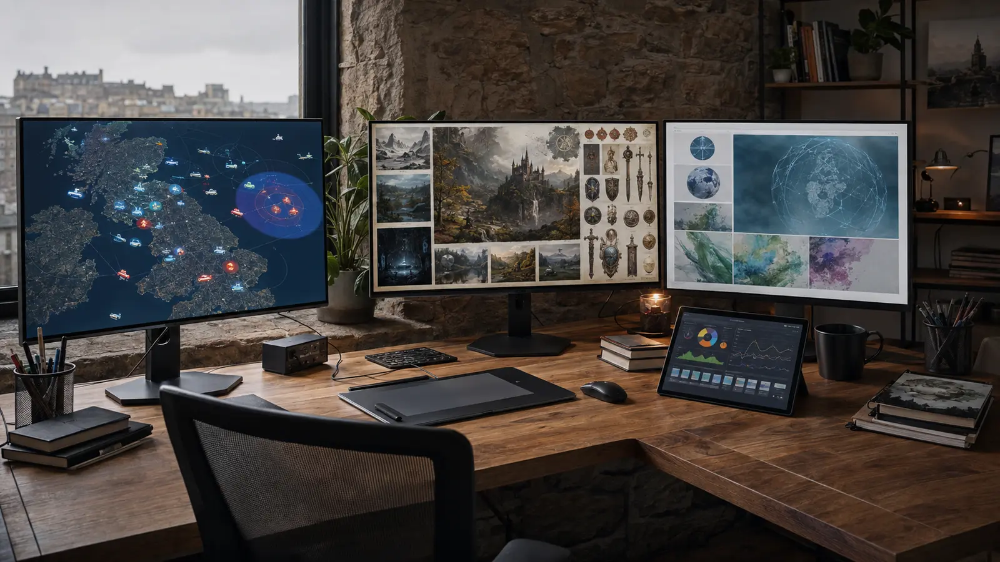
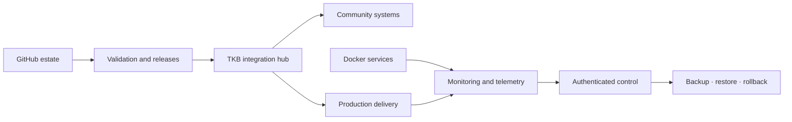

# Daniel Conroy

<h2>I build the systems behind communities, games and live operations.</h2>

<strong>Independent systems architect · Product builder · Founder of Team Killing Bastards · Edinburgh, Scotland</strong>

[**The work**](#the-work) · [**TKB**](#01--team-killing-bastards) · [**Collaboration**](#collaboration-with-clear-credit) · [**Infrastructure**](#conroymedia) · [**Activity**](#github-activity)

<table>
<tr>
<td width="50%" align="center"><a href="https://tkb-gaming.scot/"><strong>EXPLORE TKB GAMING</strong> Community, guides and public products</a></td>
<td width="50%" align="center"><a href="https://tkb-gaming.scot/mission-chief-scripts/map-command-toolkit/"><strong>INSTALL THE TOOLKIT</strong> Official supported distribution</a></td>
</tr>
<tr>
<td width="50%" align="center"><a href="https://conroy1988.github.io/Achievements/"><strong>OPEN THE ENCYCLOPEDIA</strong> Evidence-led GitHub achievement research</a></td>
<td width="50%" align="center"><a href="https://github.com/Conroy1988/Brave-Auto-Page-Translator"><strong>VIEW THE TRANSLATOR</strong> Private, rule-driven in-page translation</a></td>
</tr>
</table>

---

## The builder

I am **Daniel Conroy**, an independent builder based in **Edinburgh, Scotland**.

I turn fragmented workflows into systems people can understand and trust: polished public products, deep game guides, community automation, private intelligence platforms and the infrastructure underneath them. I move from product direction and interface design through architecture, implementation, validation, deployment and live operation.

The work is deliberately varied. The standard is not.

<table>
<tr>
<td width="50%" valign="top"><strong>01 · DISCOVER</strong> Map the real workflow, its evidence and its failure points.</td>
<td width="50%" valign="top"><strong>02 · DESIGN</strong> Make complex state legible, responsive and worth using.</td>
</tr>
<tr>
<td width="50%" valign="top"><strong>03 · CONTROL</strong> Keep authority, safety boundaries and recovery visible.</td>
<td width="50%" valign="top"><strong>04 · OPERATE</strong> Own the result after launch day—not just the first build.</td>
</tr>
</table>

---

## The work

Seven first-party systems form the core portfolio. Some are public and fully inspectable; some remain private because they handle community operations, market data or unreleased product work. Every project below states that boundary clearly.

### 01 · Team Killing Bastards

<table>
<tr>
<td width="64%" valign="top">

#### [TKB Gaming](https://tkb-gaming.scot/) · community and publishing ecosystem

I founded and originally created **Team Killing Bastards** and now lead its identity, technical direction and long-term stewardship alongside [MartyBlyth](https://github.com/Martyblyth).

The current platform brings the main community site, specialist game guides, scripts and operational systems into one maintained estate.

- [**Crimson Desert Guide**](https://tkb-gaming.scot/games/crimson-desert/guides/) — evidence-led, patch-aware field guide to Pywel
- [**Eco Guide**](https://tkb-gaming.scot/games/eco/guides/) — versioned guide and world database
- [**MissionChief UK Guide**](https://tkb-gaming.scot/games/missionchief/guides/) — UK operations intelligence, tools and structured data
- [**MissionChief Scripts**](https://tkb-gaming.scot/mission-chief-scripts/) — supported distribution for TKB browser tools

</td>
<td width="36%" valign="top">

<strong>MY ROLE</strong> 
Founder · Community lead · Co-owner · Product and operations direction

 <strong>DELIVERY</strong> 
Static parent site · Astro applications · independent validation and restricted deployment gates

 <strong>STATE</strong> 
Private production monorepo with public live surfaces

</td>
</tr>
</table>

The original standalone Crimson Desert and MissionChief repositories are archived source history. Their maintained successors live inside the TKB Website estate, with provenance and migration history preserved.

### 02 · MissionChief Map Command Toolkit

<table>
<tr>
<td width="64%" valign="top">

#### [One operational layer for the mission, the fleet, the map and the account](https://github.com/Conroy1988/missionchief-toolkit-assets)

The Toolkit turns MissionChief's scattered signals into one responsive command experience: incident priority, fleet state, map intelligence, resource pressure, transport workflows, finance, diagnostics and safe recovery.

It keeps MissionChief authoritative. The product surfaces the signal, reaches the correct native control and fails closed when evidence is incomplete.

**My role:** Creator · Product designer · Maintainer · Release authority · Production owner

</td>
<td width="36%" valign="top">

[**Install / update**](https://tkb-gaming.scot/mission-chief-scripts/map-command-toolkit/) 
[**Open the field guide**](https://conroy1988.github.io/missionchief-toolkit-assets/) 
[**Explore eight interfaces**](https://conroy1988.github.io/missionchief-toolkit-assets/themes/) 
[**Inspect the source**](https://github.com/Conroy1988/missionchief-toolkit-assets)

</td>
</tr>
</table>

### 03 · GitHub Achievement Encyclopedia

<table>
<tr>
<td width="50%" valign="top">

#### [Evidence before folklore](https://conroy1988.github.io/Achievements/)

A maintained reference for GitHub profile achievements that separates official documentation, reproduced behaviour, observations, historical records, community claims and unknowns.

The project combines human-readable guides with privacy-safe evidence records, verification timelines, bounded research tasks and a validated static API.

**My role:** Creator · Research owner · Maintainer · Release authority

</td>
<td width="50%" valign="top">

[**Explore the encyclopedia**](https://conroy1988.github.io/Achievements/) 
[**Search the research**](https://conroy1988.github.io/Achievements/search/) 
[**Review the evidence register**](https://github.com/Conroy1988/Achievements/blob/main/docs/evidence-register.md) 
[**Use the static API**](https://github.com/Conroy1988/Achievements/blob/main/docs/api-reference.md)

</td>
</tr>
</table>

### 04 · Auto Page Translator for Brave

<table>
<tr>
<td width="64%" valign="top">

#### [Independent, configurable in-page translation](https://github.com/Conroy1988/Brave-Auto-Page-Translator)

A privacy-conscious Manifest V3 extension for Brave and Chromium. It translates readable text inside the original page, preserves the real site and its interactive state, and restores the original content in one action.

Manual/minimal-access mode is the default. Approved-site automation, per-site targets, live-page updates, glossaries and provider choices remain explicit, configurable and testable—with no analytics or developer-operated translation server.

**My role:** Creator · Product designer · Maintainer

</td>
<td width="36%" valign="top">

<strong>PRIVACY</strong> 
Explicit first-run consent · no telemetry · minimum access by default

 <strong>ENGINEERING</strong> 
Manifest V3 · incremental live-page queue · Shadow DOM support · Playwright end-to-end tests

 <strong>STATE</strong> 
Independent public source with validated release packaging

[**Open the repository**](https://github.com/Conroy1988/Brave-Auto-Page-Translator)

</td>
</tr>
</table>

### 05–07 · Private systems

<table>
<tr>
<td width="33%" valign="top">

#### 05 · TKB Discord Bot

The private operational backbone for community progression, administration, GitHub integration, service status, gateways and recovery.

**My role:** Sole technical owner · Maintainer · Security authority · Live operator

</td>
<td width="33%" valign="top">

#### 06 · Investor Matrix

A self-hosted market-intelligence, portfolio-accounting and risk-control platform that keeps evidence, uncertainty and human authority visible.

**My role:** Project lead · Admin authority · Architecture and delivery direction

</td>
<td width="34%" valign="top">

#### 07 · UK Fire Command

A persistent map-first Fire and Rescue Service management game with stations, appliances, trained crews, real-road response and escalating incidents.

**My role:** Creator · Product owner · Architecture authority

</td>
</tr>
</table>

These systems are private by design. Credentials, deployment topology, user data, market records and recovery material stay outside this public page.

---

## Collaboration with clear credit

Good collaboration should make ownership clearer, not blur it.

### [MissionChief Command Nexus](https://github.com/Team-Killing-Bastards/MissionChief-Command-Nexus)

Command Nexus is **MartyBlyth's project**. Marty is the creator, principal userscript author, technical owner and release authority.

I support its repository infrastructure, documentation, validation and general operations. With Marty's permission, I also independently initiated, designed and implemented the scoped **iOS Safari compatibility** work delivered across v1.0.15–v1.0.18. The Resource Administration and Mission Finder engines remain Marty's work.

### Marty-owned systems

I also provide organisation, portfolio and delivery support across **Blyth Control Centre** and **Blyth Crypto Paper Bot**. Marty remains their creator, project owner and primary technical authority.

### LSSM V.4 · upstream contributions

My LSSM work is submitted under upstream maintainer authority. The public fork is a contribution workspace—not a first-party product.

| Pull request | Contribution | Verified state |
|---|---|---|
| [**#3982**](https://github.com/LSS-Manager/LSSM-V.4/pull/3982) | Optional monospaced notes across native and redesigned editors, documentation and ten locales | Open · mergeable |
| [**#3988**](https://github.com/LSS-Manager/LSSM-V.4/pull/3988) | Alliance member loading, role and activity filters, de-duplication and sorting | Open · mergeable |

---

## ConroyMedia

**ConroyMedia** is the live self-hosted environment where architecture meets operating reality.

It connects Docker services, Caddy routing, DDNS, media automation, service monitoring, Windows telemetry, GitHub Apps and isolated runners, Home Assistant integrations, deployment controls, backups and tested recovery paths.

```mermaid
flowchart LR
    Code[GitHub estate] --> Gate[Validation and releases]
    Gate --> Hub[TKB integration hub]
    Hub --> Community[Community systems]
    Hub --> Deploy[Production delivery]
    Services[Docker services] --> Observe[Monitoring and telemetry]
    Deploy --> Observe
    Observe --> Control[Authenticated control]
    Control --> Recover[Backup · restore · rollback]
```

> A system is not operational because it started once. It is operational when it can explain its state, limit its authority and survive failure.

---

## Working stack

---

## GitHub activity

Repository-owned cards are regenerated from GitHub's API. Private work and some organisation activity remain intentionally outside public statistics.

---

## Beyond the build

Usually: PC gaming, Linux and handheld tinkering, self-hosted infrastructure, interface concepts, game worlds or cinematic music experiments.

Development is supervised by **Eli and Nala**, who contribute no code but retain decisive control over keyboard availability.

---

### Build useful systems. Make authority visible. Operate for the long term

Independent projects and community systems. Third-party product names and trademarks remain the property of their respective owners.

