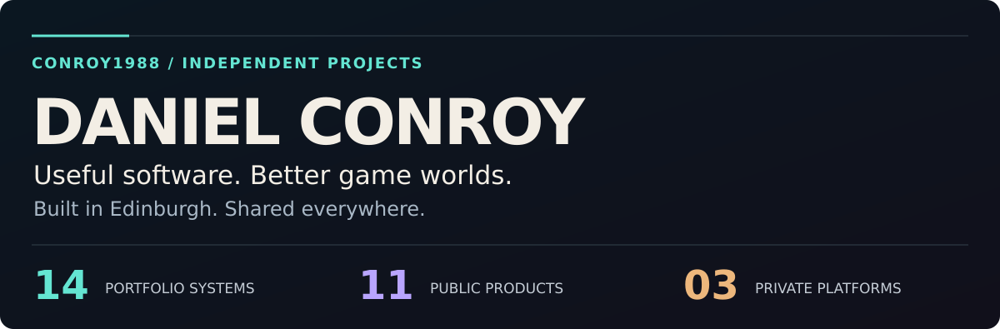
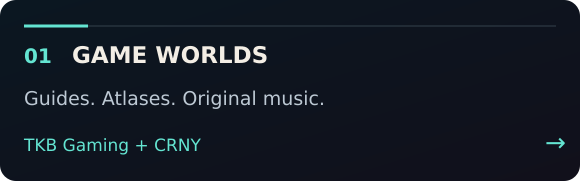
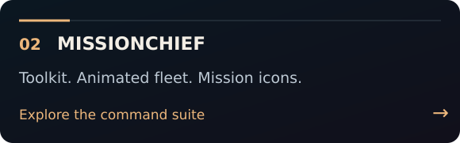
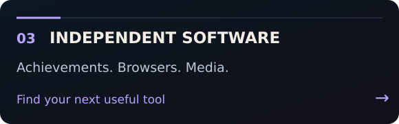
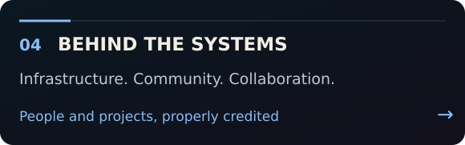

  
  

  <a href="https://tkb-gaming.scot/"><strong>TKB GAMING ↗</strong></a> &nbsp; · &nbsp;
  <a href="https://github.com/Conroy1988?tab=repositories"><strong>PUBLIC SOURCE ↗</strong></a> &nbsp; · &nbsp;
  <a href="https://tkb-gaming.scot/soundscape/"><strong>CRNY MUSIC ↗</strong></a> &nbsp; · &nbsp;
  <a href="https://ko-fi.com/D4P124RWI9"><strong>SUPPORT ↗</strong></a>

I'm **Dan**, an independent project creator based in **Edinburgh, Scotland**, and co-owner of **TKB Gaming** alongside [MartyBlyth](https://github.com/Martyblyth).

I build around the things I use: tools that make a game easier to command, guides that answer the next question, software that removes an everyday annoyance, and systems that keep a community running. My work brings together product direction, interface design, development and ongoing maintenance.

  
  
  
  

## Start here

| Put it to work | What you get |
| :--- | :--- |
| **[Install the MissionChief Toolkit →](https://chromewebstore.google.com/detail/missionchief-map-command/lmnojpchebgcochdfnfjmnficicnaaoc)** | Map controls, mission insights, fleet tools and guided administration in one browser extension. **Early Access**; check the store for the current release and support status. |
| **[Download Achievement Relay →](https://github.com/Conroy1988/Achievement-Relay/releases/latest)** | Your new Xbox and Steam achievements, shared to Discord from a Windows tray app. |
| **[Explore the Palworld companion →](https://tkb-gaming.scot/games/palworld/)** | An interactive atlas, Palpedia, breeding tools, comparisons and practical field guides. |
| **[Install Private Auto Page Translator →](https://chromewebstore.google.com/detail/auto-page-translator-for/pilpighhgdglgngmakjepoadacbhpoeo)** | Context-aware translation inside the page, with reading tools and controls for individual sites. |

## Game worlds

**[TKB Gaming](https://tkb-gaming.scot/)** brings the community, guides and creative projects together. Marty and I are equal co-owners. Each guide is built around what players need to find, understand or do next.

| Explore | Inside |
| :--- | :--- |
| **[Palworld Field System](https://tkb-gaming.scot/games/palworld/)** | Atlas, Palpedia, breeding, crafting, skills, comparisons and a local save inspector. |
| **[MissionChief UK Command Centre](https://tkb-gaming.scot/games/missionchief/guides/)** | Missions, vehicles, stations, training and emergency-service planning. |
| **[Crimson Desert](https://tkb-gaming.scot/games/crimson-desert/guides/)** | A field guide to Pywel, its quests, systems and world. |
| **[ARK / DamoDex](https://tkb-gaming.scot/games/ark-survival-ascended/)** | Creature, map, resource and survival intelligence for ARK: Survival Ascended. |
| **[Battlefield War Room](https://tkb-gaming.scot/games/battlefield/)** | The squad's service records, shared history and community activity. |
| **[Eco](https://tkb-gaming.scot/games/eco/guides/)** | A guide and world database for industry, government and civilisation. |
| **[DrainSim](https://tkb-gaming.scot/games/drainsim/guides/)** | Mission, equipment and troubleshooting guidance. |
| **[TKB Soundscape / CRNY](https://tkb-gaming.scot/soundscape/)** | My cinematic music projects, brought together in a dedicated listening space. |

## MissionChief

**One suite: the controls, the fleet and the incident map.** These are my projects; Command Nexus is credited separately below.

### Map Command Toolkit

Bring map controls, mission information, fleet and building tools, task status and searchable settings into a compact command interface. Guided operations cover patient transport, recruitment, academy courses, expansion planning and station icon copying. Saved presets help repeat a setup; game actions still require review and confirmation.

**[Install from the Chrome Web Store →](https://chromewebstore.google.com/detail/missionchief-map-command/lmnojpchebgcochdfnfjmnficicnaaoc)** · [Source & issues](https://github.com/Conroy1988/missionchief-toolkit-assets) · [Field Guide](https://conroy1988.github.io/missionchief-toolkit-assets/)

The browser manages store updates. When moving from the userscript or an unpacked build, export supported settings first and disable duplicate installations. The store listing carries the current release status and limitations.

### UK Emergency Fleet & mission icons

| Animated vehicles | Illustrated mission markers |
| :--- | :--- |
| **TKB UK Emergency Fleet** — UK emergency vehicles, distinctive silhouettes, independent lighting and helicopter rotor animation, with a performance-focused fleet design. | **UK Emergency Response Icons Reborn 2026** — illustrated incident markers with independent response levels, service information and native red, amber and green states. |
| **[Use vehicle pack 5897 →](https://www.missionchief.co.uk/vehicle_graphics/5897)** · [Fleet gallery](https://tkb-gaming.scot/games/missionchief/guides/fleet-gallery/) · [Source](https://github.com/Conroy1988/missionchief-uk-animated-graphics) | **[Use mission pack 539 →](https://www.missionchief.co.uk/mission_graphics/539)** · [Icon gallery](https://github.com/Conroy1988/UK-Emergency-Response-Icons-Reborn-2026/blob/main/GALLERY.md) · [Source](https://github.com/Conroy1988/UK-Emergency-Response-Icons-Reborn-2026) |

## Independent software

### Achievement Relay

**The unlock happens in your game. The celebration reaches your Discord.**

A Windows tray app that watches connected Xbox and local Steam achievements and posts newly proven unlocks to your chosen Discord channel. Collector Cards put game artwork and achievement details centre stage. Local Steam monitoring, a desktop Signal Strip and verified automatic updates round out the experience.

**[Download for Windows →](https://github.com/Conroy1988/Achievement-Relay/releases/latest)** · [Source](https://github.com/Conroy1988/Achievement-Relay) · [Setup guide](https://github.com/Conroy1988/Achievement-Relay/blob/main/GETTING_STARTED.md)

Xbox monitoring uses your own OpenXBL key; Steam monitoring uses the local client. Initial history is a silent baseline. See the project for provider and device limitations.

### Browser tools

| Project | The everyday problem it solves |
| :--- | :--- |
| **[Private Auto Page Translator](https://github.com/Conroy1988/Brave-Auto-Page-Translator)** | Read another language without leaving the original page. Contextual translation, reading and writing assistance, and site-specific controls. Approved external translation has an explicit privacy boundary. **[Install →](https://chromewebstore.google.com/detail/auto-page-translator-for/pilpighhgdglgngmakjepoadacbhpoeo)** |
| **[ChatTime for ChatGPT](https://github.com/Conroy1988/ChatTime-for-ChatGPT)** | See when a message was actually created. Configurable timestamps, local time or UTC, and placement controls; message time comes from the page, with no extension network requests. **[Setup →](https://github.com/Conroy1988/ChatTime-for-ChatGPT#install-locally)** |
| **[Level — Smart Volume for Brave](https://github.com/Conroy1988/Level-Smart-Volume-for-Brave)** | Hear quiet dialogue and contain sudden blasts. Adaptive loudness control with four listening modes and local audio processing. **[Explore →](https://github.com/Conroy1988/Level-Smart-Volume-for-Brave#readme)** |

### Media, presence & research

| Project | What it does |
| :--- | :--- |
| **[Emby Best Episodes](https://github.com/Conroy1988/Emby-Best-Episodes)** | Builds rating-sorted season playlists across your Emby library without changing episode metadata or original season order. |
| **[Discord Game Emulator](https://github.com/Conroy1988/Discord-Game-Emulator)** | An experimental Windows utility for cosmetic game presence through Discord's local Rich Presence connection. It does not prove gameplay, complete Quests or earn Orbs. |
| **[GitHub Achievement Encyclopedia](https://conroy1988.github.io/Achievements/)** | An evidence-led reference for GitHub achievements, with research records and a static API. Official facts, reproduced behaviour and uncertain claims stay distinguishable. **[Source →](https://github.com/Conroy1988/Achievements)** |

## Behind the systems

Some work is public to use; some exists to keep everything else running. These private projects are described at portfolio level.

| Private project | Purpose & my role |
| :--- | :--- |
| **TKB Discord Bot / ConroyMedia** | Community progression, member tools, service monitoring and recovery. **Technical owner and operator.** |
| **Investor Matrix** | Market research, portfolio accounting, paper trading and explainable decision support. **Project lead and delivery direction.** |
| **UK Fire Command** | A persistent Fire and Rescue Service management game with stations, crews, training and map-based operations. **Creator and product owner.** |

### Collaboration, with proper credit

**[MissionChief Command Nexus](https://github.com/Team-Killing-Bastards/MissionChief-Command-Nexus)** is **MartyBlyth's project**. Marty is its developer, creator and technical owner. **I assist** with documentation, repository infrastructure, validation, operations and scoped compatibility work. It is not counted as one of my products.

**Blyth Control Centre and other Marty-owned systems** remain Marty's work. I provide organisational and delivery support.

**[LSSM V.4](https://github.com/Conroy1988/LSSM-V.4)** is my upstream contribution workspace. Contributions include [monospaced notes](https://github.com/LSS-Manager/LSSM-V.4/pull/3982) and [alliance-member loading and sorting](https://github.com/LSS-Manager/LSSM-V.4/pull/3988); the upstream maintainers control review and release.

### How I work

Start with a real use case. Make the interface clear. Verify the change. Keep maintaining it after release.

Across these projects I work with **JavaScript / TypeScript, Python, C#, Rust and PowerShell**, supported by browser extensions, desktop frameworks, web applications, Docker and GitHub Actions. The technology follows the job.

<strong>Portfolio register & project history</strong>

The [project register](data/portfolio.json) tracks fourteen first-party systems: eleven public products and three private platforms. TKB's guides and Soundscape are grouped under TKB Gaming. Collaborations, forks and recovery mirrors are recorded separately from original products.

- [Crimson-Desert-Guide](https://github.com/Conroy1988/Crimson-Desert-Guide) and [MissionChief-UK](https://github.com/Conroy1988/MissionChief-UK) are archived sources; the maintained public guides are linked above.
- [RED4ext](https://github.com/Conroy1988/RED4ext) is a third-party fork.
- The private Toolkit recovery repository is infrastructure, not a separate product.
- The organisation profile and demo repository support the community and development workflow.

## Public activity

<strong>Explore the public development snapshot</strong>

Cards refresh from GitHub's API. Activity is a sample of recent public events, not a complete contribution count. Private work is excluded; the language sample also includes public TKB organisation repositories.

---

Away from the projects: PC gaming, handheld tinkering, self-hosting and cinematic music. **Eli and Nala** supervise keyboard access.

  <strong>Made to be used. Built to keep improving.</strong>  
  <a href="https://tkb-gaming.scot/">Explore TKB Gaming</a> ·
  <a href="https://github.com/Team-Killing-Bastards">Meet the organisation</a> ·
  <a href="https://ko-fi.com/D4P124RWI9">Support the projects</a>

