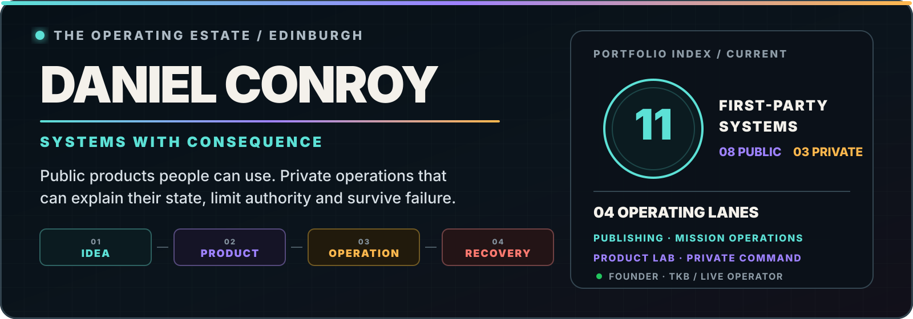
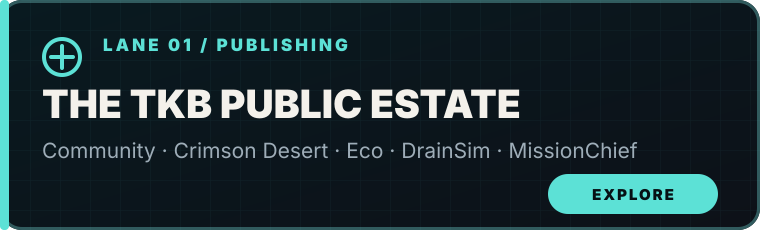
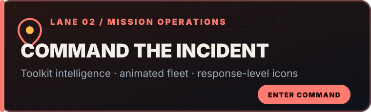
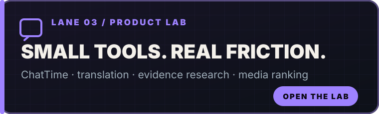
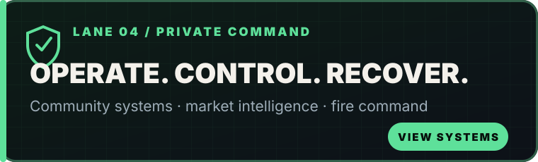
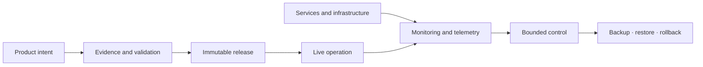

 

  
  
  
  

  <strong>PORTFOLIO INDEX</strong> 
  <a href="#the-builder">Builder</a> ·
  <a href="#portfolio-register">Register</a> ·
  <a href="#01--public-estate">Publishing</a> ·
  <a href="#02--mission-operations">Mission operations</a> ·
  <a href="#03--product-lab">Product lab</a> ·
  <a href="#04--private-command">Private command</a> ·
  <a href="#collaboration-without-blurred-ownership">Collaboration</a> ·
  <a href="#public-activity">Activity</a>

---

## The builder

I am **Daniel Conroy**, an independent systems architect and product builder based in **Edinburgh, Scotland**.

I turn persistent friction into working systems: community platforms, game intelligence, emergency-command tools, browser utilities, media software, private market intelligence and the infrastructure that keeps them alive. My work spans product direction, interface design, architecture, implementation, evidence, validation, delivery and live operation.

The subject changes. The operating standard does not.

| Discover the real problem | Design the decision surface |
| --- | --- |
| Map the workflow, authority, evidence and failure points before shaping the interface. | Make complex state legible, responsive and worth acting on. |
| **Ship with proof** | **Remain accountable** |
| Validate the exact build, preserve a recovery path and make distribution unambiguous. | Observe the live system, constrain its authority and own what happens after launch. |

> I do not treat “it started once” as an operational definition.

---

## Portfolio register

The current estate contains **eleven first-party systems**: **eight public products** and **three private operational platforms**. Collaborations, forks, upstream contributions, private recovery mirrors and archived source history are deliberately kept outside that ownership count.

| Public product | What it is · my role |
| --- | --- |
| **[TKB Gaming](https://tkb-gaming.scot/)** | Community and publishing estate for the TKB website, game guides and supported products. **Founder · Co-owner · Product and operations direction** |
| **[MissionChief Map Command Toolkit](https://github.com/Conroy1988/missionchief-toolkit-assets)** | Responsive command layer for mission, fleet, map, transport and financial intelligence. **Creator · Product designer · Maintainer · Release authority** |
| **[TKB UK Emergency Fleet — Animated](https://github.com/Conroy1988/missionchief-uk-animated-graphics)** | Original UK emergency-services vehicle graphics for MissionChief. **Creator · Product direction · Maintainer** |
| **[UK Emergency Response Icons Reborn 2026](https://github.com/Conroy1988/UK-Emergency-Response-Icons-Reborn-2026)** | Complete mission-marker system with native states and permanent TKB Response Levels. **Creator · Product direction · Maintainer** |
| **[ChatTime for ChatGPT](https://github.com/Conroy1988/ChatTime-for-ChatGPT)** | Privacy-first Chromium extension that reveals the original date and time of ChatGPT messages. **Creator · Product designer · Maintainer** |
| **[GitHub Achievement Encyclopedia](https://conroy1988.github.io/Achievements/)** | Evidence-led reference, research system and static API for GitHub profile achievements. **Creator · Research owner · Maintainer** |
| **[Auto Page Translator for Brave](https://github.com/Conroy1988/Brave-Auto-Page-Translator)** | Rule-driven translation inside the original webpage with explicit privacy boundaries. **Creator · Product designer · Maintainer** |
| **[Emby Best Episodes](https://github.com/Conroy1988/Emby-Best-Episodes)** | Server plugin that creates rating-sorted season playlists without changing Emby metadata. **Creator · Product owner · Maintainer** |

| Private system | What it is · my role |
| --- | --- |
| **TKB Discord Bot and ConroyMedia Operations** | Community progression, administration, GitHub integration, host telemetry, gateways and controlled recovery. **Technical owner · Security authority · Live operator** |
| **Investor Matrix** | Self-hosted market intelligence, portfolio accounting, risk control and explainable decision support. **Project lead · Admin authority · Architecture and delivery direction** |
| **UK Fire Command** | Persistent map-first Fire and Rescue Service management game with real-road response and server-authoritative operations. **Creator · Product owner · Architecture authority** |

The machine-readable ownership register is maintained in [`data/portfolio.json`](data/portfolio.json). The same source drives the generated portfolio totals below, preventing the written page and automated metrics from drifting apart.

---

## 01 · Public estate

### [Team Killing Bastards](https://tkb-gaming.scot/) · community, publishing and product operations

I founded and originally created **Team Killing Bastards** and now lead its identity, technical direction and long-term stewardship alongside [MartyBlyth](https://github.com/Martyblyth). The current production estate unifies the parent community, specialist game intelligence and supported product distribution inside one governed monorepo.

| Public surface | Mission |
| --- | --- |
| **[TKB Gaming](https://tkb-gaming.scot/)** | The community home, origin story, core squad and route into the wider estate. |
| **[Battlefield War Room](https://tkb-gaming.scot/games/battlefield/)** | TKB service records, shared Battlefield history, commendations and live community activity. |
| **[DamoDex · ARK: Survival Ascended](https://tkb-gaming.scot/games/ark-survival-ascended/)** | Interactive creature, map, resource and survival intelligence with patch-aware source controls. |
| **[Crimson Desert Guide](https://tkb-gaming.scot/games/crimson-desert/guides/)** | Evidence-led, patch-aware field guide to Pywel, its systems, quests and world. |
| **[Eco Guide](https://tkb-gaming.scot/games/eco/guides/)** | Versioned guide and world database for civilisation, industry, government and the meteor clock. |
| **[DrainSim Guide](https://tkb-gaming.scot/games/drainsim/guides/)** | Mission, equipment and troubleshooting intelligence maintained inside the production estate. |
| **[MissionChief UK Command Centre](https://tkb-gaming.scot/games/missionchief/guides/)** | Searchable missions, units, stations, training and fleet-planning intelligence. |
| **[MissionChief Scripts](https://tkb-gaming.scot/mission-chief-scripts/)** | Supported installation and update channel for TKB MissionChief products. |

The production monorepo remains private because it contains deployment topology and operational controls. The finished public surfaces remain open. The retired standalone Crimson Desert and MissionChief repositories are preserved as source history with their migration provenance intact.

---

## 02 · Mission operations

One suite now covers the decision layer, the moving fleet and the incident map.

### [MissionChief Map Command Toolkit](https://github.com/Conroy1988/missionchief-toolkit-assets)

The Toolkit turns MissionChief's scattered signals into one responsive command environment: incident priority, resource pressure, fleet state, patient transport, map intelligence, coverage, financial reconciliation, diagnostics and safe recovery.

It does not replace MissionChief's authority. It makes the operational picture legible and reaches the correct native controls. Incomplete evidence fails closed.

[**Install or update from TKB Scripts**](https://tkb-gaming.scot/mission-chief-scripts/map-command-toolkit/) · [**Open the field guide**](https://conroy1988.github.io/missionchief-toolkit-assets/) · [**Explore eight interfaces**](https://conroy1988.github.io/missionchief-toolkit-assets/themes/) · [**Inspect release control**](https://github.com/Conroy1988/missionchief-toolkit-assets/blob/release-state/status/README.md)

> **TKB Scripts is the sole supported public installation and update route.** GitHub is the canonical source, release archive and engineering record.

### [TKB UK Emergency Fleet — Animated](https://github.com/Conroy1988/missionchief-uk-animated-graphics)

A complete original UK emergency-services vehicle pack with static and animated map assets, independent emergency-light rhythms, helicopter rotor motion, specialist silhouettes and automated visibility testing.

[**Preview the complete fleet**](https://github.com/Conroy1988/missionchief-uk-animated-graphics/blob/main/GALLERY.md) · [**Use vehicle pack 5897 in MissionChief**](https://www.missionchief.co.uk/vehicle_graphics/5897)

### [UK Emergency Response Icons Reborn 2026](https://github.com/Conroy1988/UK-Emergency-Response-Icons-Reborn-2026)

Every mapped UK mission receives a compact incident marker and a permanent **TKB Response Level 1–5**. MissionChief's native red, amber and green states remain independent, so priority and live progress never become the same signal.

[**Browse every mission slot**](https://github.com/Conroy1988/UK-Emergency-Response-Icons-Reborn-2026/blob/main/GALLERY.md) · [**Use mission pack 539 in MissionChief**](https://www.missionchief.co.uk/mission_graphics/539)

---

## 03 · Product lab

The product lab starts with annoyances that should not require a server, a subscription or an invasion of privacy to solve.

### [ChatTime for ChatGPT](https://github.com/Conroy1988/ChatTime-for-ChatGPT) · newest public product

ChatTime reveals the original creation date and time of messages on `chatgpt.com`. It supports local time or UTC, 12-hour or 24-hour clocks, optional dates and seconds, placement above or below messages, and independent user/reply visibility.

The extension uses message time already loaded in the page. It has no server, analytics, advertising, account, remote code or network requests; its only extension permission stores display preferences.

[**Open the project**](https://github.com/Conroy1988/ChatTime-for-ChatGPT) · [**Read the privacy policy**](https://github.com/Conroy1988/ChatTime-for-ChatGPT/blob/main/PRIVACY.md)

### [Auto Page Translator for Brave](https://github.com/Conroy1988/Brave-Auto-Page-Translator)

A privacy-conscious Manifest V3 extension for Brave and Chromium. It translates readable text inside the original page, preserves the real site's session and interactive state, restores original content in one action and keeps automation explicitly site-scoped.

[**Install from the Chrome Web Store**](https://chromewebstore.google.com/detail/auto-page-translator-for/pilpighhgdglgngmakjepoadacbhpoeo) · [**Inspect the public source**](https://github.com/Conroy1988/Brave-Auto-Page-Translator)

### [GitHub Achievement Encyclopedia](https://conroy1988.github.io/Achievements/)

An evidence-led reference that separates official documentation, reproduced behaviour, historical records, community claims and unknowns. Human-readable guidance sits beside privacy-safe evidence records, verification timelines, bounded research tasks and a validated static API.

[**Explore the encyclopedia**](https://conroy1988.github.io/Achievements/) · [**Search the research**](https://conroy1988.github.io/Achievements/search/) · [**Inspect the evidence register**](https://github.com/Conroy1988/Achievements/blob/main/docs/evidence-register.md) · [**Use the static API**](https://github.com/Conroy1988/Achievements/blob/main/docs/api-reference.md)

### [Emby Best Episodes](https://github.com/Conroy1988/Emby-Best-Episodes)

An Emby Server plugin that builds best-rated playlists for each TV season without changing season order, episode metadata, ratings or watched state. It can rank one show, selected shows or the full visible library, then refresh after scans or on a schedule.

[**Open the repository**](https://github.com/Conroy1988/Emby-Best-Episodes) · [**Read the Emby community release thread**](https://emby.media/community/topic/148991-plugin-best-episodes-%E2%80%93-highest-rated-episode-playlists-by-season/)

---

## 04 · Private command

These systems are private by design. Credentials, deployment topology, member data, market records and unreleased game state do not belong on a public profile.

| System | Operational mission | My authority |
| --- | --- | --- |
| **TKB Discord Bot and ConroyMedia Operations** | Community progression, Passport and member surfaces, private health intelligence, GitHub integration, service monitoring, host telemetry, incident correlation, HTTPS gateways, deployment and recovery. | Technical owner · Maintainer · Security authority · Live operator |
| **Investor Matrix** | US and UK market intelligence, portfolio accounting, Paper Trading Laboratory, explainable research prioritisation, auditing and human-controlled risk decisions. No broker execution. | Project lead · Admin authority · Architecture and delivery direction |
| **UK Fire Command** | Persistent Fire and Rescue Service management across Scotland or England: stations, appliances, crews, training, qualification-valid mobilisation, real roads and server-authoritative escalation. | Creator · Product owner · Architecture authority |

Public descriptions explain purpose and boundaries. They do not expose secrets, member information, recovery material or enough topology to weaken the live estate.

---

## Collaboration without blurred ownership

Good collaboration should make authorship clearer—not absorb somebody else's work into my portfolio count.

### [MissionChief Command Nexus](https://github.com/Team-Killing-Bastards/MissionChief-Command-Nexus)

**MartyBlyth is the developer, creator, principal userscript author, technical owner and release authority. Command Nexus remains Marty's project.**

I am the **project helper** for repository infrastructure, documentation, validation and general operations. With Marty's permission, I also contributed scoped iOS Safari compatibility work. The Resource Administration and Mission Finder engines remain Marty's work.

### Marty-owned private systems

I provide organisation, portfolio and delivery support around **Blyth Control Centre** and other Marty-owned work. Marty remains their creator, product owner and primary technical authority.

### LSSM V.4 · upstream contributions

My public LSSM fork is a contribution workspace—not a first-party product. Both changes remain under upstream maintainer authority, with their live review state left to the pull-request pages.

| Pull request | Contribution |
| --- | --- |
| [**#3982**](https://github.com/LSS-Manager/LSSM-V.4/pull/3982) | Optional monospaced notes across native and redesigned editors, documentation and supported locales. |
| [**#3988**](https://github.com/LSS-Manager/LSSM-V.4/pull/3988) | Complete alliance-member loading plus role, activity and local sorting controls. |

---

## ConroyMedia

**ConroyMedia** is where architectural claims meet operating reality.

It connects Docker services, Caddy routing, DDNS, media automation, service monitoring, Windows telemetry, GitHub Apps and isolated runners, Home Assistant integrations, deployment controls, backups and tested recovery paths.

```mermaid
flowchart LR
    Idea[Product intent] --> Proof[Evidence and validation]
    Proof --> Release[Immutable release]
    Release --> Operate[Live operation]
    Services[Services and infrastructure] --> Observe[Monitoring and telemetry]
    Operate --> Observe
    Observe --> Control[Bounded control]
    Control --> Recover[Backup · restore · rollback]
```

> A dependable system can explain its state, identify its authority and show the route home when something fails.

---

## Working stack

---

## Public activity

Repository-owned cards regenerate from GitHub's API. Private work and some organisation activity remain intentionally outside public statistics.

---

## Project history and contribution workspaces

<strong>Archived sources, mirrors, forks and non-product repositories</strong>

 

- [`Crimson-Desert-Guide`](https://github.com/Conroy1988/Crimson-Desert-Guide) — archived source history; maintained successor is the TKB Website estate.
- [`MissionChief-UK`](https://github.com/Conroy1988/MissionChief-UK) — archived source history; maintained successor is the TKB Website estate.
- [`LSSM-V.4`](https://github.com/Conroy1988/LSSM-V.4) — public fork used for upstream contribution work.
- `missionchief-map-command-toolkit-private` — private recovery authority, not a second public product.
- `RED4ext` — third-party fork, not presented as original work.
- `demo-repository` — organisation test infrastructure, not a portfolio product.

---

## Beyond the build

Usually: PC gaming, Linux and handheld tinkering, self-hosted infrastructure, interface concepts, game worlds or cinematic music experiments.

Development is supervised by **Eli and Nala**, who contribute no code but retain decisive control over keyboard availability.

---

### Build useful systems. Make authority visible. Stay after launch

Independent projects and community systems. Third-party product names and trademarks remain the property of their respective owners.

